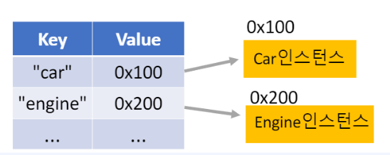
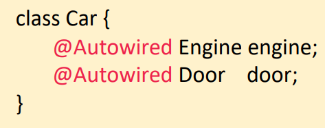
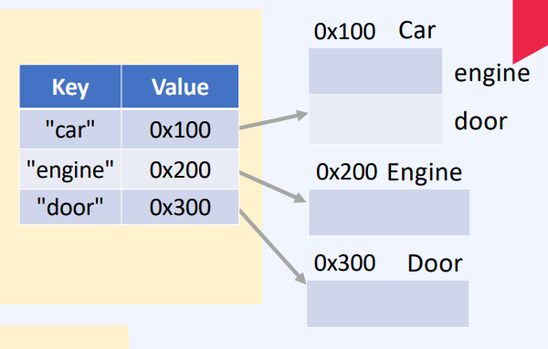
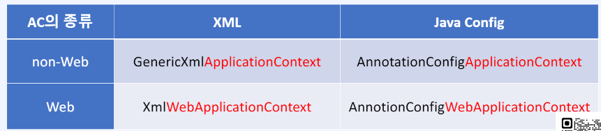

# Day53

## Spring DI

**Spring DI**

* DI(Dependency Injection)의존성 주입이란 맵에 있는 객체를 꺼내서 사용하는것이며 객체를 직접 생성하는 것이 아닌 외부에서 생성 후 주입 시켜주는 것
* config.txt 파일에 key와 value 싱글톤으로 이루어져있으며 fly weight 패턴이라고 부름.

**1. 정적 팩토리 메서드, 외부파일 config.txt활용**

```java
// As-is 다형성 활용
Car car = new SportsCar();
Car car = new Truck();

// 1. To-be 정적 팩토리 메서드 활용
static Car getCar(){
    return new SportsCar();
}

static Car getCar(){
    return new Truck();
}

// 2. Map과 외부 파일 활용
Car car = (Car) getObject("car");
Engine engine = (Engine) getObject("engine");

static Object getObject(String key) throws Exception{
    // config.txt를 읽어서 Properties에 저장
    Properties p = new Properties();
    p.load(new FileReader("config.txt"));

    // 클래스 객체를 얻는다.
    Class clazz = Class.forName(p.getProperty(key))

    // 객체 생성해서 반환
    return clazz.newInstance();
}
```
```
// config.txt
car=com.fastcampus.ch3.SportsCar
engine=com.fastcompus.ch3.Engine
```

* 객체를 바꾸고자 한다면 config.txt 파일만 변경할 수 있다는 장점이 존재함.

**2. 객체 컨테이너 ApplicationContext Map에 객체를 만들고 사용함**

```java
AppContext ac = new AppContext();

Car car = (Car) ac.getBean("car");
Engine engine = (Engine) ac.getBean("engine");
```

**3. 자동 객체 등록 Component Scanning**

```java
class Car {} -> @Component class Car {}
class SportsCar extencs Car {} -> @Component class SportsCar extends Car {}
```

* @Component 어노테이션이 붙으면 별도 파일을 사용하지 않고도 Map에 객체를 넣어줄 수 있음.
* key를 사용할 때는 첫 글자가 소문자가됨. key = car,sportsCar ...

**4. 객체 찾기 - by Name, by Type**



```java
AppContext ac = new AppContext();

// 이름으로 찾기
Car car = (Car) ac.getBean("car");

Object getBean(String id){  
    return map.get(id);
}

// 타입으로 찾기
Car car2 = (Car) ac.getBean(Car.class);

Object getBean(Class clazz){
    for(Object obj : map.values()){
        if(clazz.instanceof(obj)){
            return obj;
        }
    }
    return null;
}
```

**5. 객체 자동 연결 하기 - @Autowird**





```java
AppContext ac = new AppContext();

Car car = (Car) ac.getBean("car");
Engine engine = (Engine) ac.getBean("engine");
Door door = (Door) ac.getBean(door");

class Car {
    @Autowired Engine engine;
    @Autowired Door door;
}
```

* 1. AC 생성
* 2. 설정파일 읽어서 Map을 채움
* 3. Map에 있는 객체를 @Autowired를 통해 생성

* @Autowired는 byType을 통해서 찾아서 객체를 연결함.

**6. 객체 자동 연결 하기 - @Resource**

```java
AppContext ac = new AppContext();
Car car = (Car) ac.getBean("car");
Engine engine = (Engine) ac.getBean("engine");
Door oor = (Door) ac.getBean(door");

class Car {
    @Resource Engine engine;
    @Resource Door door;
}
```

* @Resource byName을 통해서 찾아서 객체를 연결함.

**스프링 DI 활용**

**1. 빈이란?**

* JavaBeans : Bean은 객체이며, 재사용 가능한 컴포넌트
* Spring Beans : POJO (보통의 자바 객체) 단순, 독립적이며 Spring Container가 관리함.

**2. BeanFactory와 ApplicationContext**

* Bean : Spring Container가 관리하는 객체
* Spring Container : Bean 저장소, 저장,관리(생성, 소멸, 연결)

**3. ApplicationContext의 종류**



**4. Root AC와 Servlet AC**

* rootAC 는 부모이며 nonweb
* servletAC는 자식이며 web

* ContextLoaderListener : rootAC 생성
* DispatcherServlet : servletAC 생성

**5. ApplicationContext 주요 메서드**

* getBeanDefinition(), getBeanDefinitionNames(), getBean(), containsBean() ...
* 빈(객체) 컨테이너 Map 구조로 되어있음.
* config.xml 은 생성할 빈 목록

**6. IOC와 DI**

* IoC : 제어의 흐름을 전통적인 방식과 다르게 뒤바꾸는 것
* DI : 사용할 객체를 외부에서 주입받는 것
* A -> I (Interface) -> B

**7. 스프링 애너테이션 @Autowired**

* @Autowired 인스턴스 변수, setter, 참조형 매개변수를 가진 생성자, 메서드에 적용

> 스프링은 단순히 Map에다가 설정하고 달라하면 주는 방식.