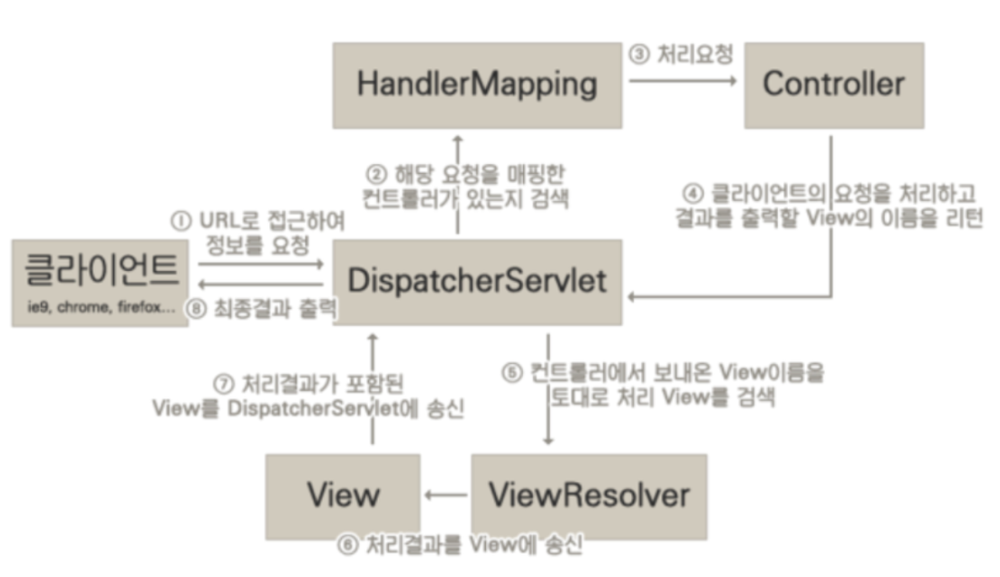

# 11주차 정리

## Dispatcher-Servlet 동작과정

1. 클라이언트의 요청을 Dispatcher Servlet에 전달
2. 요청한 url에 맞는 controller 검색하여 Handler Mapping에 전달
3. HandlerMapping에서 해당 controller에 처리 요청
4.  controller에서 처리 결과를 Handler Adapter에서 ModelAndView 객체로 변환하여 Dispatcher Servlet에 전달
5. Dispatcher Servlet에서 전달받은 ModelAndView 객체를 이용하여 매핑되는 View를 검색
6. viewResolver에서 처리 결과를 view에 전달
7. 처리결과가 포함된 view를 Dispatcher Servlet에 전달
8. Dispatcher Servlet에서 최종 응답 결과를 클라이언트에게 반환

## Spring legacy project 회원가입, 로그인, 게시판 구축해보기.