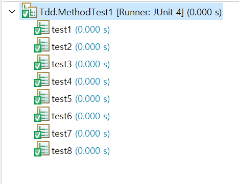
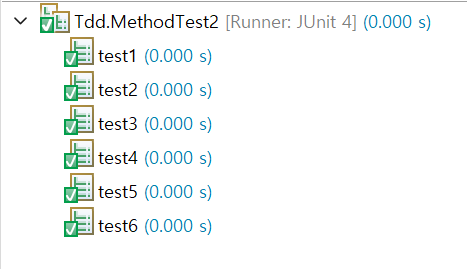

# Day8 요약 및 헷갈리는 개념

## this(), this

* this() - 생성자, 같은 클래스의 다른 생성자를 호출할 때 사용.
    * 한 생성자에서 다른 생성자를 호출할 때는 첫 줄에서만 호출이 가능함.
    * 생성자의 이름으로 클래스이름 대신 this를 사용함.
* this - 객체(인스턴스) 자신을 가리키는 참조변수
    
## 변수의 초기화

* cv -> tv - 자동초기화(0)
* lv - 수동초기화
* 자동(0) -> 간단(=) -> 복잡 ( {}, 생성자 )

**초기화방법**

1. 명시적초기화
```java
class Car{
    int door = 4;
    Engine e = new Engine();
}
```
2. 생성자
3. 초기화블럭
```java
// 클래스 초기화 블럭
static{

}

// 인스턴스초기화 블럭
{ }
```

* 클래스 초기화순서 : 기본값 -> 명시적초기화 -> 클래스초기화블럭
* 인스턴스 초기화순서 : 기본값 -> 명시적초기화 -> 인스턴스초기화블럭

> 자동 -> 간단 -> 복잡 기억하기

## 클래스간의 관계 - 상속, 포함

**상속**

* 기존클래스 재사용하여 새로운 클래스 작성하는 것
* 생성자, 초기화블럭은 상속되지 않고 멤버만 상속됨.
* 실무에서 상속은 잘쓰이고 있지 않음. (주로 포함관계 has - a)
* 상속은 is - a 관계, 원은 점이다.

**포함**

```java
class Circle{
    int x;
    int y;
    int z;

    // 포함관계
    // 유연한 구조 메모리 2개임. 
    // 한 개는 c의 주소, 한 개는 r -> r은 x,y를 가르킴.
    Point c = new Point();
    int r;
}

class Point{
    int x;
    int y;
}
```

* ex) 반환타입이 Card card = new Card(); 이면 Card는 객체의 주소를 반환한다고 생각하면됨.

## 객체 지향 설계 5대원칙 SOLID

* S - SRP 단일책임 원칙 1개의 메서드가 1개의 일만 진행함
* O - OCP 확장에는 open, 변경은 close (변경하지말고 확장해라)
* L
* I
* D

## TDD 문제풀이 테스트

```java
package Tdd;

import static org.junit.Assert.*;
import org.junit.Test;

public class MethodTest1 {

   /*
    * Q1. 세 개의 정수를 받아서 중간 값을 반환하는 메서드 mid를 작성하고 테스트하시오
    * 
    * int mid(int x, int y, int z){
    *       return y;
    * }
    * 
    * 배열, 정렬 X
    * 
    * 1.
    * y x z
    * z x y
    * 2.
    * x y z
    * z y x
    * 3.
    * x z y
    * y z x
    * 
    */
   // n m x
   int mid(int x, int y, int z){
      
     int mid = 0;
     
     if(y <= x  && x <= z || z <= x && x <= y) { mid = x ; }
     else if(x <= y  && y <= z || z <= y && y <= x) { mid = y; }
     else{ mid = z;}
      
      return mid;
   }
   
   @Test
   public void test1() {
      assertTrue(mid(1,2,3) == 2);
   }
   
   @Test
   public void test2() {
      assertTrue(mid(1,2,3) == 2);
   }
   
   @Test
   public void test3() {
      assertTrue(mid(1,3,2) == 2);
   }
   
   @Test
   public void test4() {
      assertTrue(mid(1,1,2) == 1);
   }
   
   @Test
   public void test5() {
      assertTrue(mid(5,4,1) == 4);
   }
   
   @Test
   public void test6() {
      assertTrue(mid(9,9,9) == 9);
   }
   
   @Test
   public void test7() {
      assertTrue(mid(-5,2,6) == 2);
   }
   
   @Test
   public void test8() {
      assertTrue(mid(1,2,5) == 2);
   }

}
```


```java
package Tdd;

import static org.junit.Assert.*;

import org.junit.Test;

public class MethodTest2 {

   /*
    * Q2. 5x5 2차원 배열을 받아서 빙고의 갯수를 세어서 반환하는 메서드를 작성하고 테스트하시오
    * 0이면 체크 안된것, 1이면 체크
    * 
    * 행,열,대각선를 비교하여 빙고가 나오면 cnt++
    */
   
   int bingoCnt(int[][] board) {
      
     int cnt = 0;
     int sum = 0;
     int[] g = new int[board.length];   // 가로
     int[] c = new int[board.length];   // 세로
     int[] d = new int[2];            // 대각선
      
     for (int i = 0; i < board.length; i++) {
         int[] js = board[i];
         for (int j = 0; j < js.length; j++) {
            int a = js[j];
            System.out.printf("(%d,%d) ", i, j);
            System.out.print(a + " ");
         
            if(board[i][j] == 1) {
               g[i]++;      // 가로
               c[j]++;      // 세로
               
               if(i==j) {      // 대각선
                  d[0]++;
               }
               if(i == 4-j) {   // 대각선
                  d[1]++;
               }
            }
         }
         System.out.println();
     } 
     
     // 대각선 카운트
     if(d[0] == board.length) {
        cnt++;
     }
     if(d[1] == board.length) {
        cnt++;
     }
     
     // 가로, 세로 카운트
     for (int i = 0; i < g.length; i++) {
      if(g[i] == g.length) {
         cnt++;
      }
      if(c[i] == g.length) {
         cnt++;
      }
     }
     System.out.println(cnt);
      return cnt;
   }
   
   @Test
   public void test1() {
      int[][] board = {
            {0,0,0,0,0},
            {0,0,0,0,0},
            {0,0,0,0,0},
            {0,0,0,0,0},
            {0,0,0,0,0}
      };
      assertTrue(bingoCnt(board) == 0);
   }
   
   @Test
   public void test2() {
      int[][] board = {
            {0,0,0,0,0},
            {1,1,1,1,1},
            {0,0,0,0,0},
            {0,0,0,0,0},
            {0,0,0,0,0}
      };
      System.out.println();
      assertTrue(bingoCnt(board) == 1);
   }
   
   @Test
   public void test3() {
      int[][] board = {
            {0,0,0,0,1},
            {1,1,1,1,1},
            {0,0,0,0,1},
            {0,0,0,0,1},
            {0,0,0,0,1}
      };
      System.out.println();
      assertTrue(bingoCnt(board) == 2);
   }
   
   @Test
   public void test4() {
      int[][] board = {
            {1,1,1,1,1},
            {1,1,1,1,1},
            {0,0,0,0,1},
            {0,0,0,0,1},
            {0,0,0,0,1}
      };
      System.out.println();
      assertTrue(bingoCnt(board) == 3);
   }
   
   @Test
   public void test5() {
      int[][] board = {
            {1,1,1,1,1},
            {1,1,1,1,1},
            {1,1,1,1,1},
            {1,1,1,1,1},
            {1,1,1,1,1}
      };
      System.out.println();
      assertTrue(bingoCnt(board) == 12);
   }
   
   @Test
   public void test6() {
      int[][] board = {
        {1,0,0,0,1},
          {0,1,0,1,0},
          {0,0,1,0,0},
          {0,1,0,1,0},
          {1,0,0,0,1}
      };
      System.out.println();
      assertTrue(bingoCnt(board) == 2);
   }

}
```
```
(0,0) 0 (0,1) 0 (0,2) 0 (0,3) 0 (0,4) 0 
(1,0) 0 (1,1) 0 (1,2) 0 (1,3) 0 (1,4) 0 
(2,0) 0 (2,1) 0 (2,2) 0 (2,3) 0 (2,4) 0 
(3,0) 0 (3,1) 0 (3,2) 0 (3,3) 0 (3,4) 0 
(4,0) 0 (4,1) 0 (4,2) 0 (4,3) 0 (4,4) 0 
0

(0,0) 0 (0,1) 0 (0,2) 0 (0,3) 0 (0,4) 0 
(1,0) 1 (1,1) 1 (1,2) 1 (1,3) 1 (1,4) 1 
(2,0) 0 (2,1) 0 (2,2) 0 (2,3) 0 (2,4) 0 
(3,0) 0 (3,1) 0 (3,2) 0 (3,3) 0 (3,4) 0 
(4,0) 0 (4,1) 0 (4,2) 0 (4,3) 0 (4,4) 0 
1

(0,0) 0 (0,1) 0 (0,2) 0 (0,3) 0 (0,4) 1 
(1,0) 1 (1,1) 1 (1,2) 1 (1,3) 1 (1,4) 1 
(2,0) 0 (2,1) 0 (2,2) 0 (2,3) 0 (2,4) 1 
(3,0) 0 (3,1) 0 (3,2) 0 (3,3) 0 (3,4) 1 
(4,0) 0 (4,1) 0 (4,2) 0 (4,3) 0 (4,4) 1 
2

(0,0) 1 (0,1) 1 (0,2) 1 (0,3) 1 (0,4) 1 
(1,0) 1 (1,1) 1 (1,2) 1 (1,3) 1 (1,4) 1 
(2,0) 0 (2,1) 0 (2,2) 0 (2,3) 0 (2,4) 1 
(3,0) 0 (3,1) 0 (3,2) 0 (3,3) 0 (3,4) 1 
(4,0) 0 (4,1) 0 (4,2) 0 (4,3) 0 (4,4) 1 
3

(0,0) 1 (0,1) 1 (0,2) 1 (0,3) 1 (0,4) 1 
(1,0) 1 (1,1) 1 (1,2) 1 (1,3) 1 (1,4) 1 
(2,0) 1 (2,1) 1 (2,2) 1 (2,3) 1 (2,4) 1 
(3,0) 1 (3,1) 1 (3,2) 1 (3,3) 1 (3,4) 1 
(4,0) 1 (4,1) 1 (4,2) 1 (4,3) 1 (4,4) 1 
12

(0,0) 1 (0,1) 0 (0,2) 0 (0,3) 0 (0,4) 1 
(1,0) 0 (1,1) 1 (1,2) 0 (1,3) 1 (1,4) 0 
(2,0) 0 (2,1) 0 (2,2) 1 (2,3) 0 (2,4) 0 
(3,0) 0 (3,1) 1 (3,2) 0 (3,3) 1 (3,4) 0 
(4,0) 1 (4,1) 0 (4,2) 0 (4,3) 0 (4,4) 1 
2
```

