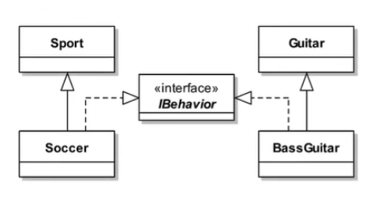

# 둘째 주 

## 배열문제 연습 풀이.

		// 1. 하나의 배열에서 중복되는 수 찾아서 중복되는 수 출력
		
		// 2. 하나의 배열에서 중복되는 수 찾아서 중복되지 않는 수 출력
		
		// 3. 하나의 배열의 요소가 인접한 수 인지 체크 인접한 수이면 true 아니면 false
		
		// 4. 하나의 배엘여서 앞뒤 값 바꾸어 출력
		
		// 5. 하나의 배열에서 정렬해서 출력
		
		// 6. 하나의 배열에서 최대값 최소값 출력
		
		// 7. 숫자 야구 게임 (4자리 수) 
        
```java
package Practice;

import java.util.Arrays;
import java.util.Scanner;

public class Self_ArrayTestEx1_1 {
	public static void main(String[] args) {
		
		int[] arr1 = {0, 1, 3, 6, 7, 3, 4, 2, 7};
		int[] arr2 = new int[arr1.length];
		
		// 1. 하나의 배열에서 중복되는 수 찾아서 중복되는 수 출력  
		for (int i = 0; i < arr1.length; i++) {
			arr2[arr1[i]]++;
		}

		System.out.println("중복되는 수");
		for (int i = 0; i < arr2.length; i++) {
			if(arr2[i] > 1) {
//				System.out.print(i + " ");	// 3, 7
			}
		}
		// 2. 하나의 배열에서 중복되는 수 찾아서 중복되지 않는 수 출력
		System.out.println();
		System.out.println("중복되지 않는 수");
		for (int i = 0; i < arr2.length; i++) {
			if(arr2[i] == 1) {
//				System.out.print(i + " ");	// 0, 1, 2, 4, 6
			}
		}
		
		// 3. 하나의 배열의 요소가 인접한 수 인지 체크 인접한 수이면 true 아니면 false
		System.out.println();
		System.out.println("인접한 수 체크");
		int[] arr3 = {1 ,2, 3, 4, 5};
		int cnt = 0;
		
		for (int i = 1; i < arr3.length; i++) {
//			System.out.println("arr3[i] : " + arr3[i]);
//			System.out.println("arr3[i-1] : " + arr3[i-1]);
			if(arr3[i-1] + 1 == arr3[i]) {
				cnt++;
			}
		}
		
		if(cnt == 4) {
//			System.out.println(true);
		}else {
//			System.out.println(false);
		}
		
		System.out.println();
		System.out.println("앞뒤 값 바꾼 배열값");
		// 4. 하나의 배열여서 앞뒤 값 바꾸어 출력
		int[] arr4 = {5, 2, 7, 4, 8};
		// 8 4 7 2 5
		for (int i = arr4.length; i > 0; i--) {
//			System.out.print(arr4[i-1] + " ");
		}
		
		System.out.println();
		System.out.println("배열 요소 정렬");
		// 5. 하나의 배열에서 정렬해서 출력
		for (int i = 0; i < arr4.length; i++) {
//			System.out.println("arr4[i] : " + arr4[i]);
//			System.out.println("i : " + i);
			for (int j = 0; j < arr4.length; j++) {
				int k = arr4[j];
//				System.out.println("arr4[j] : " + arr4[j]);
				if(arr4[i] < arr4[j]) {
					int tmp = arr4[i];
					arr4[i] = arr4[j];
					arr4[j] = tmp;
				}
			}
		}
		
		for (int i : arr4) {
//			System.out.print(i + " ");
		}
		System.out.println();
		System.out.println("하나의 배열에서 최대값 최소값 출력");
		// 6. 하나의 배열에서 최대값 최소값 출력
		int[] arr5 = {7, 4, 6, 1, 5, 2, 9, 12};
		int max = arr5[0];
		int min = arr5[0];
		for (int i = 0; i < arr5.length; i++) {
			for (int j = 0; j < arr5.length; j++) {
				if(arr5[i] > max) {
					max = arr5[i];
					arr5[i] = arr5[j];
					arr5[j] = max;
				}else if(arr5[i] < min){
					min = arr5[i];
					arr5[i] = arr5[j];
					arr5[j] = min;
				}
			}
		}
//		System.out.println(max);
//		System.out.println(min);
		
		// 7. 숫자 야구 게임 (4자리 수)
		System.out.println();
		System.out.println("숫자 야구 게임 (4자리)");
		int count = 0;			// 5번 넘어가면 게임 종료
		int[] answer = {6, 3, 8, 5};
		int[] arr6 = new int[4];
		int S = 0;
		int B = 0;
		Scanner sc = new Scanner(System.in);
		
		do {
			for (int i = 0; i < arr6.length; i++) {
				arr6[i] = sc.nextInt();
				// 입력한 숫자와 answer을 비교
				if(arr6[i] == answer[i]) {
					S++;
				}else {
					B++;
				}
			}
			count++;
			System.out.println(S+"S"+B+"B 입니다.");
			if(S == 4) {
				System.out.println("정답입니다");
				break;
			}
			System.out.println("남은 시도 횟수는 " + (5-count) + " 회 입니다.");
			S = 0;
			B = 0;
			if(count == 5) {
				System.out.println("사용 시도 횟수를 초과했습니다.");
			}
		}while(count < 5);
	}
}
```		

## 다형성 (인터페이스, 추상화) 정리 및 예제 정리. 

### 인터페이스

* 추상화보다 더 유연하고 추상적이며 추상화 클래스가 미완성 설계도라면 인터페이스는 그 미완성 설계도를 그리는 밑그림.
* 추상 메서드의 집합이며 다중 상속이 가능함.
* 인터페이스도 필드를 선언할 수는 있지만 변수가 아닌 상수로서 정의가 가능함.
* public static final 과 public abstract 제어자는 생략 가능함.

```java
interface 인터페이스이름{
    public static final 타입 상수이름 = 값;
    public abstract 타입 메서드이름(매개변수목록);
}

// --------------------------------------------------------

interface TV {
    int MAX_VOLUME = 10; // public static final 생략 가능
    int MIN_VOLUME = 10;

    void turnOn(); // public abstract 생략 가능
    void turnOff();
    void changeVolume(int volume);
    void changeChannel(int channel);
}
```


* 인터페이스는 extends 대신 implements 라는 구현이라는 키워드를 사용함으로써 부모 - 자식 관계를 연관시키는게 아닌 클래스를 확장 시켜 다양하게 이용하는데 중점을 둠.
* 클래스가 구현하는 인터페이스의 메서드 중 일부만 구현한다면 abstract 로 추상클래스로서 선언해야함.

```java
interface Animal {
    void walk();
    void run();
    void breed();
}

// Animal 인터페이스를 일부만 구현하는 포유류 추상 클래스
abstract class Mammalia implements Animal {
    public void walk() { ... }
    public void run() { ... }
    // public void breed() 는 자식 클래스에서 구체적으로 구현하도록 일부로 구현하지 않음 (추상 메서드로 처리)
}

class Lion extends Mammalia {
    @Override
    public void breed() { ... }
}
```

### 인터페이스 자체 상속


* 인터페이스끼리의 상속은 다중 상속이 가능함.
* 클래스의 상속과 마찬가지로 자식은 부모의 정의된 멤버를 모두 상속 받음.
* 필드의 경우는 기본적으로 static 이므로 구현체를 따라가지 않음.

```java
interface Changeable{
    /* 채널을 바꾸는 기능의 메서드 */
    void change();
}

interface Powerable{
    /* 전원을 껐다 켰다 하는 메서드 */
    void power(boolean b);
}

// 채널 기능과 전원 기능을 가진 인터페이스들을 하나의 인터페이스로 통합 상속
interface Controlable extends Changeable, Powerable { 
	// 인터페이스끼리 다중 상속하면 그대로 추상 멤버들을 물려 받음
}

// 클래스에 통합된 인터페이스를 그대로 상속
class MyObject implements Controlable {
	public void change() {
        System.out.println("채널을 바꾸는 기능의 메서드");
    }
    public void power(boolean b) {
        System.out.println("전원을 껐다 켰다 하는 메서드");
    }
}

public class Main {
	public static void main(String[] args) {
        // 인터페이스 다형성 (인터페이스를 타입으로 취급해서 업캐스팅 가능)
        Controlable[] o = { new MyObject(), new MyObject() };
        o[0].change();
        o[0].power(true);
        
        // 각각 단일 인터페이스로도 타입으로 사용이 가능하다. (그러나 지니고 있는 추상 메서드만 사용이 가능하다)
        Changeable inter1 = new Changeable();
        inter1.change(); 

        Powerable inter2 = new Powerable();
        inter2.power(true);
    }
}

interface Iflower {
    int ex = 10; // 각각 public static final
}

interface IPlant extends Iflower {
    int ex = 20; // 각각 public static final
}

class Tulip implements IPlant {
    int ex = 30; // 그냥 인스턴스 변수
}

public class Main {
	public static void main(String[] args) {
        // 클래스 타입 객체로 ex 멤버에 접근하면, 클래스 인스턴스 변수로 접근
        Tulip t =  new Tulip();
        System.out.println(t.ex); // 30

        // 인터페이스 타입 객체로 멤버에 접근하면, 인터페이스 static 상수로 접근
        Iflower a = new Tulip();
        System.out.println(a.ex); // 10 - 좋지않은 방법
        System.out.println(Iflower.ex); // 10 - 클래스 static 처럼 '인터페이스.멤버' 로 접근

        IPlant b = new Tulip();
        System.out.println(b.ex); // 20 - 좋지않은 방법
        System.out.println(IPlant.ex); // 20 - 클래스 static 처럼 '인터페이스.멤버' 로 접근
    }
}
```

### default 메소드 

* 디폴트 메서드는 인터페이스 구현 이후, 모든 구현체들에게 함수를 만들어주고 싶을 때 사용됨.
* 접근 제어자가 public 이며 생략 가능하고, 자식 클래스에서 오버라이딩하여 재정의 가능함.

```java
interface Calculator {
    int plus(int i, int j);
    int multiple(int i, int j);

    // default로 선언함으로 메소드를 구현할 수 있다.
    default int sub(int i, int j){      
        return i - j;
    }
}

// Calculator인터페이스를 구현한 MyCalculator클래스
class MyCalculator implements Calculator {
    // 추상 메서드만 구현해줌
    @Override
    public int plus(int i, int j) { return i + j; }
    @Override
    public int multiple(int i, int j) { return i * j; }
}

public class Main {
    public static void main(String[] args){
        MyCalculator mycal = new MyCalculator();
        
        // 인터페이스 타입으로 업캐스팅
        Calculator cal = (Calculator) mycal; // 괄호 생략해도 됨

        // 인스턴스의 인터페이스 디폴트 메서드 호출
        int value = cal.sub(5, 10);
        System.out.println(value); // -5
    }
}
```

* 다중 인터페이스들 간의 디폴트 메서드 충돌
* 똑같은 디폴트 메서드를 가진 두 인터페이스를 하나의 클래스에 구현하고 아무런 조치를 하지 않으면 컴파일이 되지 않음.
* 인터페이스를 구현한 클래스에서 디폴트 메서드를 오버리이딩 하여 하나로 통합해야함.

```java
interface A1{
    public void styleA();

    // 메소드 시그니처가 같은 디폴트 메서드
    default public void styleSame(){
        System.out.println("A1 인터페이스의 디폴트 메서드 입니다.");
    }
}

interface B1{
    public void styleB();

    // 메소드 시그니처가 같은 디폴트 메서드
    default public void styleSame(){
        System.out.println("B1 인터페이스의 디폴트 메서드 입니다.");
    }
}

class MultiInterface implements A1, B1 {
    @Override
    public void styleA() {}
    @Override
    public void styleB() {}

    // 두 인터페이스 디폴트 메서드중 A1 인터페이스의 디폴트 메서드를 오버라이딩 하여 구현
    default public void styleSame(){
        System.out.println("A1 인터페이스의 디폴트 메서드 입니다.");
    }
}

public class Main {
    public static void main(String[] args) {
        MultiInterface m1 = new MultiInterface();
        m1.styleSame(); // "A1 인터페이스의 디폴트 메서드 입니다."
    }
}
```

* 부모 클래스의 메서드가 상속되고 디폴트 메서드는 무시됨.
* 인터페이스 쪽의 디폴트 메서드를 사용할 필요가 있다면, 필요한 쪽의 메서드와 같은 내용으로 그냥 오버라이딩 해버리면 됨.

### default 메소드의 super

* 상위 클래스를 상속하고 상위의 메소드를 오버라이딩하여 재정의하였을 때, 부모 메서드를 호출할 일이 생기면 super 를 통해 부모 메서드를 호출할 수 있음.

```java
interface IPrint{
    default void print(){
        System.out.println("인터페이스의 디폴트 메서드 입니다.");
    }
}

class MyClass implements IPrint {
    @Override
    public void print() {
        IPrint.super.print(); // 인터페이스의 super 메서드를 호출
        System.out.println("인터페이스의 디폴트 메서드를 오버라이딩한 메서드 입니다.");
    }
}

public class Main {
    public static void main(String[] args) {
        MyClass cls = new MyClass();
        cls.print();
    }
}
```
```
인터페이스의 디폴트 메서드 입니다.
인터페이스의 디폴트 메서드를 오버라이딩한 메서드 입니다.
```

### static 메소드

* 일반 클래스의 static 메소드와 다를 바 없음.

### 인터페이스 활용

* 부모클래스의 타입으로 자식 클래스 타입을 포함 시킬 수 있다는 다형성의 법칙은 인터페이스에도 적용이 가능함.

```java
// 나쁜 예) 클래스를 바로 타입으로 사용했다.
LinkedHashSet<Object> s = new LinkedHashSet<>();

// 좋은 예) 인터페이스를 타입으로 사용했다.
Set<Object> s = new LinkedHashSet<>();

// 본래 LinkedHashSet으로 구현하였다가 사정이 생겨 TreeSet클래스로 변경해야한다고 하면, 그냥 인터페이스 타입의 변수에 재할당만 하면 된다
Set<Object> s = new LinkedHashSet<>();
s = new TreeSet<>();
```

* 하지만 무조건적으로 인터페이스 타입으로 선언하는 습관은 꼭 좋은 것은 아님.
* HashSet으로 변환하는 일이 생기면 순서를 보장하지 않아 로직에 문제가 생길 수 있음.

### 인터페이스 활용 예제1

* 그림만 보고 구현해보기.



```java
public class InterfaceTests1_1 {

	public static void main(String[] args) {
		play(new Soccer());
		play(new BassGuitar());
	}
	public static void play(IBehavior ib) {
		ib.play();
	}
}

public class Sport {

}
public class Guitar {

}
public class Soccer extends Sport implements IBehavior{

	@Override
	public void play() {
		System.out.println("축구경기 ~~");
	}
}
public class BassGuitar extends Guitar implements IBehavior{

	@Override
	public void play() {
		System.out.println("베이스 기타 연주 ~~");
	}
}
public interface IBehavior {

	public void play();
}
```
```
축구경기 ~~
베이스 기타 연주 ~~
```

* **인터페이스를 메소드의 매개변수 타입으로 받음으로써 인터페이스에 등록된 추상메서드를 실행하면 실제 구현 클래스의 오버라이딩한 구현 메서드가 실행**
* 다형성을 통해 코드 중복을 없애고 유지 보수의 이점이 생김.

### 추상클래스와 추상화

* 구체적이지 않은 추상적인 데이터를 담고 있는 미완성 클래스임.
* **클래스간의 공통점을 찾아내서 부모 클래스를 만드는 것.** - 추상화
* 메소드의 선언부만 작성하고 구현부는 미완성인 채로 남겨둔 메서드.

### 추상클래스 예제

```java
package MyPackage;

//추상 클래스
abstract class Pet {
	abstract public void walk(); // 추상 메소드

	abstract public void eat(); // 추상 메소드
	
	public int health; // 인스턴스 필드
	
	public Pet() {
		health = 100;
	}

	public void run() { // 인스턴스 메소드
		System.out.print("펫 채력 : " + this.health + "! ");
		System.out.println("run run ~~");
	}
}

class Dog extends Pet {
	// 상속 받은 부모(추상) 메소드를 직접 구현
	public void walk() {
		System.out.println("Dog walk");
	}

	public void eat() {
		System.out.println("Dog eat");
	}
}

public class abstractsTest {
	public static void main(String[] args) {
		Dog d = new Dog();
		d.eat(); // 부모(추상) 클래스로 부터 상속받은 추상 메소드를 직접 구현한 메소드를 실행
		d.walk();
		d.run(); // 부모(추상) 클래스의 인스턴스 메소드 실행
	}
}
```
```
Dog eat
Dog walk
펫 채력 : 100! run run ~~
```

* 추상 메서드를 포함하고 있다는 것을 제외하고는 일발 클래스와 다른 점이 없음.
* 단지 상속하면 선언부인 abstract 메서드를 구현한다는점의 차이, 직접 인스턴스 객체로 만들 수 없다는 차이 정도가 있음.

### 추상클래스 설계 구현

* 예를 들어 안드로이드 어플을 구성하는 클래스를 만든다 가정.
	* 어플과 휴대폰의 연동에 대한 규격이 없다면??
	* 어떻게 설계할지 막막한 경우가 발생할 수 있음.
	* 하지만 구글이 미리 만들어둔 안드로이드 SDK에서 제공하는 추상 클래스를 상속받으면 필요한 추상 메서드만 구현하면됨.

> 즉, 추상 클래스를 상속받아서 미리 정의된 공통 기능들을 구현하고, 필요한 기능들을 클래스별로 확장시킴으로써 유지보수의 성능이 좋아짐.

### 인터페이스, 추상화 차이점, 동시 사용방법

* 인터페이스와 추상화에 대해서 자세하게 알아보았으니 이제 둘의 차이점, 실제 코드는 어떻게 작성되는지 알아보자.


* 둘의 차이점을 잘알려주는 표.

#### 인터페이스 vs 추상클래스 사용처

* 개념과 사용방법, 차이점도 알아보았으니 언제 사용되는지도 알아보자.

#### 추상클래스 사용하는 경우

1. 상속 받을 클래스들이 공통으로 가지는 메서드와 필드가 많아 중복 멤버 통합을 할 때
2. 구현 세부 정보의 일부 기능만 지정했을 때
3. 하위 클래스가 오버라이드하여 재정의하는 기능들을 공유하기 위한 상속 개념을 사용할 때
4. **상속할 각 객체들의 공통점을 찾아 추상화시켜 놓은 것으로, 상속 관계를 타고 올라갔을 때 같은 부모 클래스를 상속하며 부모 클래스가 가진 기능들을 구현해야할 경우 사용함.**

**중복 멤버 통합**

* 같은 추상화 개념인 인터페이스와 차이점을 두기 위해, 상수 밖에 정의 못하는 인터페이스에서는 할 수 없는 기능이 추상 클래스 중복 멤버 통합임.

#### 인터페이스를 사용하는 경우

1. 서로 관련성이 없는 클래스들을 묶어 주고 싶을때 (형제 관계)
2. 다중 상속(구현)을 통한 추상화 설계를 해야할때

**자유로운 타입 묶음**

* 인터페이스의 가장 큰 특징은 상속에 구애 받지 않은 구현이 가능하다는 것.

#### 추상 클래스에 인터페이스 일부 구현 예제

```java
package MyPackage;

public class AbstractsInterface {

	public static void main(String[] args) {
//		Mammalia animal = new Lion();
		Animal animal = new Lion();
		animal.breed();
	}
}

interface Animal {
    void walk();
    void run();
    void breed();
}

// Animal 인터페이스를 일부만 구현하는 포유류 추상 클래스
abstract class Mammalia implements Animal {
    public void walk() {
    	System.out.println("walk walk ~~");
    }
    public void run() {
    	System.out.println("run run ~~");
    }
    // breed() 메서드는 자식 클래스에서 구체적으로 구현하도록 일부로 구현하지 않음 (추상 메서드로 처리)
}

// 인터페이스 + 추상 클래스를 상속하여 사용
class Lion extends Mammalia {
    @Override
    public void breed() {
    	System.out.println("breed breed ~~");
    }
}
```
```
breed breed ~~
```