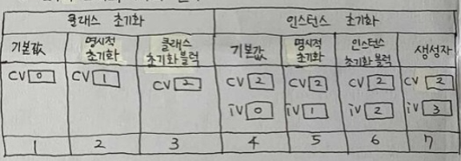
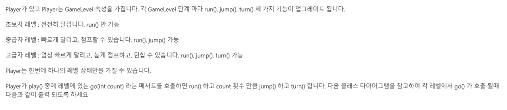

# 셋째 주 

## 6~7장 시험대비 개념 정리 

### 객체지향 프로그래밍 핵심 개념 외우기

#### 객체지향언어 특징 (OOP 특징)

**OOP특징**

1. **재사용성이 높다.**
2. **유지보수가 용이하다.**
3. **중복 코드 제거**

**핵심개념**

1. 다형성 : **부모 타입의 참조변수로 자식의 인스턴스를 생성**
2. 캡슐화 : **외부로부터 데이터를 보호하기위해서 사용**
            * public - 모든 접근 권한
            * protected - 같은 패키지, 자손 클래스까지 접근 권한
            * default - 같은 패키지
            * private - 같은 클래스
3. 추상화 : **클래스의 공통된 기능을 모아 부모 클래스로 만드는 것.** 추상클래스는 앞에 abstract 를 사용하며 추상 클래스를 상속한 자식 클래스는 abstract가 붙은 메서드는 반드시 재정의하여 사용해야합니다. 추상클래스는 인스턴스 변수와 메서드를 가질 수 있으며 인스턴스화 할 수 없습니다.
4. 상속 : **기존 클래스로 새로운 클래스를 작성하는 것.** 자식 클래스 extends 부모 클래스 형식으로 사용하며 자식 클래스는 부모 클래스의 변수와, 메서드를 사용가능합니다.

#### 클래스와 객체

**클래스**

**객체를 생성하고 사용하기 위함.**

1. 설계도
2. 변수+메서드의 묶음
3. 사용자 정의 타입

**객체**

1. 실제로 존재하는 것.
2. 인스턴스 변수의 묶음.

#### 변수의 종류

* 선언위치에 따른 변수의 종류

* 영역
1. 클래스영역
    * cv (클래스변수) : 객체 생성없이 사용가능하며 클래스가 메모리에 올라갈 때 생성됩니다.
    * iv (인스턴스변수) : 객체 생성해야 사용가능하며 인스턴스가 생성될 때 생성됩니다.
2. 메서드영역
    * lv (지역변수) : 메서드 내에 선언된 변수이며, 호출될 때 생성됩니다. 메서드가 종료되면 제거.

**클래스변수 인스턴스 변수**

1. 클래스변수 : 공통속성을 이용할 때 사용합니다.
    * static 으로 하나의 저장공간을 공유하므로 항상 공통된 값
    * 클래스이름.cv
2. 인스턴스변수 : 개별속성을 이용할 때 사용합니다.
    * 인스턴스가 생성될 때마다 생성되므로 각기 다른 값
    * 참조변수.iv

#### 메서드

* 문장들을 작업단위로 묶어서 이름 붙인 것

**장점**

1. 코드 중복 제거
2. 관리가 쉬움
3. 재사용 가능
4. 코드 간결화

#### 오버로딩

**같은 이름의 메서드를 매개변수의 타입이나 개수를 다르게 작성**

**조건**

1. 매개변수의 타입이나 개수가 달라야함.
2. 매서드 이름이 같아야함.
3. 반환타입은 영향 없음.

#### 오버라이딩

**부모클래스 메서드를 자식클래스에서 재정의하여 사용**

**조건**

1. 선언부가 같아야 합니다.
2. 부모클래스보다 접근 제어자가 좁으면 안됩니다.
3. 부모클래스보다 예외처리 개수가 많으면 안됩니다.

#### 생성자

**인스턴스 초기화 메서드**

**조건**

1. 클래스와 이름이 같아야합니다.
2. 다른 생성자 호출 시 this()
3. 생성자 첫 줄에 다른 생성자 호출 or super() 자동 삽입
4. 모든 클래스엔 반드시 하나 이상의 생성자가 있어야합니다.
5. 생성자가 하나도 없으면 컴파일러가 기본 생성자를 자동 추가해줍니다.

#### 멤버 변수 초기화와 시기, 순서



* 자동 -> 간단 ->  복잡 순으로 순서가 진행됩니다.
* 클래스가 메모리에 올라갈 때 생성되는 클래스 변수인 cv가 우선적으로 초기화됩니다.
    * 기본값 -> 명시적 초기화 -> 클래스 초기화 블럭
* 클래스 변수가 초기화되고 다음으로 인스턴스가 초기화됩니다.
    * 기본값 -> 명시적 초기화 -> 인스턴스 초기화 블럭 -> 생성자

* 멤버변수는 자동초기화되어지고, 지역변수는 프로그래머가 수동으로 초기화해줘야됩니다.

#### 상속

**기존 클래스로 새로운 클래스를 작성하는 것**

* 자식클래스 extends 부모클래스 형태로 사용합니다.
* 자식클래스는 부모클래스의 모든 iv와 메서드를 상속 받습니다.(생성자, 초기화블럭 제외)
* 상속관계는 is ~a 포함관계는 has ~a 이며 대부분 포함관계를 사용합니다.

**super()**

* 생성자와 초기화블럭은 상속이 안되므로 조상의 생성자를 호출할 때 사용합니다.
* 그러므로 조상의 멤버는 조상의 생성자(super())를 호출해서 초기화합니다.
* 생성자의 첫 줄에 반드시 생성자를 호출해야합니다.

#### 다형성

1. **조상타입 참조변수로 자손타입 객체를 생성하는 것**
2. **하나의 배열에 여러종류의 객체를 저장**

* 참조변수가 사용할 수 있는 멤버의 개수는 인스턴스의 멤버개수보다 같거나 적습니다.

#### 추상클래스

**미완성 설계도, 미완성 메서드를 갖고 있는 클래스**

1. 인스턴스로 생성이 불가합니다.
2. 클래스들의 공통된 기능을 모아서 부모클래스로써 사용
3. 자식클래스들은 추상클래스들을 상속받아 오버라이딩하여 추상메서드의 구현부를 구현하여 사용합니다.

#### 인터페이스

**추상메서드의 집합, 구현 기능이 없는 밑그림**

* 모든 멤버가 public으로 되어있습니다.
* 변수는 정의할 수 없고 변수로 정의해도 (public static final)이 생략되어있습니다.
* 메서드도 (public abstract) 이 생략되어있고 구현부는 정의할 수 없습니다.
* 인터페이스는 다중상속이 가능합니다.
* 추상클래스와 둘 다 추상메서드를 가진다는 공통점이 있지만 인터페이스는 다중 상속이 가능하고 iv를 가질 수 없습니다.

#### 인터페이스 장점

**Ex**

* A클래스가 B클래스를 직접 호출하지 않고 인터페이스를 거친 설계를 통해서 A는 I하고만 의존하는 관계를 맺어 I를 통해 B를 호출합니다. 
    * 이렇게 느슨한 결합을 해줌으로써 A는 B클래스가 C클래스에서 바뀐다고해도 소스 수정할 필요가 없어집니다.
    * 이로서 얻는 장점은 아래와 같습니다.

1. 개발시간을 단축할 수 있다.
2. 표준화가 가능합니다.
3. 서로 관계없는 클래스들을 관계 맺어줄 수 있습니다.
4. 변경에 유리한 설계가 가능합니다.
5. 선언과 구현을 분리할 수 있습니다.


## 인터페이스 실사용예제 더 알아보기


* 위 그림만 보고 구현해보기.

```java
package MyPackage;

public class AbstractInterfaceTestEx1_1 {

	public static void main(String[] args) {
		
		Parrot parrot = new Parrot();
		Tiger tiger = new Tiger();
		People people = new People();
		Whale whale = new Whale();
		Shark shark = new Shark();
		
		System.out.println("=== Parrot ===");
		parrot.breath();
		parrot.bark();
		
		System.out.println("=== Tiger ===");
		tiger.breath();
		tiger.bark();
		
		System.out.println("=== People ===");
		people.breath();
		people.bark();
		people.swim();
		
		System.out.println("=== Whale ===");
		whale.breath();
		whale.tail();
		whale.swim();
		
		System.out.println("=== Shark ===");
		shark.breath();
		shark.tail();
		shark.swim();
	}
}
```
```
=== Parrot ===
기관지로 호흡합니다.
짹쨱
=== Tiger ===
기관지로 호흡합니다.
어흥
=== People ===
기관지로 호흡합니다.
야호
자유형
=== Whale ===
아가미로 호흡합니다.
고래 꼬리
고래 수영
=== Shark ===
아가미로 호흡합니다.
상어 꼬리
상어 수영
```

* 클래스간의 상속과정은 간단하므로 생략.
* Parrot, Tiger는 수영할 수 없다는 전제로 Swimmable 인터페이스를 구현하지 않았음.
* interface를 사용함으로써 수영을 할 수 있는 형제관계로써 사용할 수 있다는 장점.
* 공통의 기능을 사용하는 클래스는 추상클래스를 부모클래스로써 사용해서 설계에 유리한 장점.





```java
// Player
package MyPackage;

public class Player {
	
	private PlayerLevel level;
	
	public Player() {
		level = new BeginnerLevel();
		level.showLevelMessage();
	}
	
	public PlayerLevel getLevel() {
		return level;
	}
	
	public void upgradeLevel(PlayerLevel level){
		this.level = level;
		level.showLevelMessage();
	}

	public void play(int counter) {
		level.go(counter);
	}
}

// PlayerLevel
package MyPackage;

abstract public class PlayerLevel {
	
	public abstract void run();
	public abstract void jump();
	public abstract void turn();
	public abstract void showLevelMessage();
	
	public void go(int count) {
		//count횟수만큼 jump하고 turn
		run();
		for (int i = 0; i < count; i++) {
			jump();
		}
		turn();
	}
	
}

// Beginner
package MyPackage;

public class BeginnerLevel extends PlayerLevel{

	@Override
	public void run() {
		System.out.println("천천히 달립니다.");
	}

	@Override
	public void jump() {
		System.out.println("jump 못하지롱");
	}

	@Override
	public void turn() {
		System.out.println("turn 못하지롱");
	}

	@Override
	public void showLevelMessage() {
		System.out.println("****** 초급자 레벨입니다. ******");
	}
}

// Advanced
package MyPackage;

public class AdvanceLevel extends PlayerLevel{

	@Override
	public void run() {
		System.out.println("빨리 달립니다.");
	}

	@Override
	public void jump() {
		System.out.println("높이 jump 합니다.");
	}

	@Override
	public void turn() {
		System.out.println("turn 못하지롱.");
	}

	@Override
	public void showLevelMessage() {
		System.out.println("****** 중급자 레벨입니다. ******");
	}
}

// Super
package MyPackage;

public class SuperLevel extends PlayerLevel{

	@Override
	public void run() {
		System.out.println("엄청 빠르게 달립니다.");
	}

	@Override
	public void jump() {
		System.out.println("아주 높이 jump 합니다.");
	}

	@Override
	public void turn() {
		System.out.println("turn 합니다.");
	}

	@Override
	public void showLevelMessage() {
		System.out.println("****** 고급자 레벨입니다. ******");
	}
}

// Main
package MyPackage;

public class PlayTests {

	public static void main(String[] args) {
		
		Player player = new Player();
		player.play(1);
		
		AdvanceLevel advanceLevel = new AdvanceLevel();
		player.upgradeLevel(advanceLevel);
		player.play(2);
		
		SuperLevel superLevel = new SuperLevel();
		player.upgradeLevel(superLevel);
		player.play(3);
	}
}
```
```
****** 초급자 레벨입니다. ******
천천히 달립니다.
jump 못하지롱
turn 못하지롱
****** 중급자 레벨입니다. ******
빨리 달립니다.
높이 jump 합니다.
높이 jump 합니다.
turn 못하지롱.
****** 고급자 레벨입니다. ******
엄청 빠르게 달립니다.
아주 높이 jump 합니다.
아주 높이 jump 합니다.
아주 높이 jump 합니다.
turn 합니다.
```

* 위 그림들만 보고 구현해보기.
* 결과는 깃허브 https://github.com/easyspubjava/FastCampus/tree/master/Chapter3/src/ch16 참고.

* 헷갈렸던점 : Player 구현.
* 기본생성자에서 시작으로 Beginner 생성자를 호출하는게 떠오르지않아 30분정도 헤맸음.
* upgradeLevel 함수에서 this.level = level; main을 보고 유추하지않으면 떠오르지 않았음.
* 다른 예제를 더 풀어보면서 객체지향설계에 익숙해져야되겠다. (바카라 카드게임, 패캠 다른 예제)

## 객체지향설계 추가예제


* 위 그림들만 보고 구현해보기.

```java
package MyPackage;

public interface Scheduler {

	public void getNextCall();
	public void sendCallToAgent();
}


package MyPackage;

public class PriorityAllocation  implements Scheduler{

	@Override
	public void getNextCall() {
		System.out.println("우선 순위가 높은 고객우선 대기열에서 가져옵니다.");
	}

	@Override
	public void sendCallToAgent() {
		System.out.println("다음 순서의 상담원에게 배분합니다.");
	}

}

package MyPackage;

public class RoundRobin implements Scheduler{

	@Override
	public void getNextCall() {
		System.out.println("상담 전화를 순서대로 대기열에서 가져옵니다.");
	}

	@Override
	public void sendCallToAgent() {
		System.out.println("다음 순서의 상담원에게 배분합니다.");
	}

}
package MyPackage;

public class LeastJob implements Scheduler{

	@Override
	public void getNextCall() {
		System.out.println("대기가 적은 상담원 우선 대기열에서 가져옵니다.");
	}

	@Override
	public void sendCallToAgent() {
		System.out.println("다음 순서의 상담원에게 배분합니다.");
	}

}

package MyPackage;

import java.io.IOException;

public class SchedulerTest {

	public static void main(String[] args) throws IOException {

		System.out.println("전화 상담원 할당 방식을 선택하세요");
		System.out.println("R : 한명씩 차례대로");
		System.out.println("L : 대기가 적은 상담원 우선");
		System.out.println("P : 우선순위가 높은 고객우선 숙련도 높은 상담원");
		
		int ch = System.in.read();
		Scheduler scheduler = null;
		
		if ( ch == 'R' || ch =='r') {
			scheduler = new RoundRobin();
		}
		else if ( ch == 'L' || ch =='l') {
			scheduler = new LeastJob();
		}
		else if ( ch == 'P' || ch =='p') {
			scheduler = new PriorityAllocation();
		}
		else {
			System.out.println("지원되지 않는 기능입니다.");
			return;
		}
		
		scheduler.getNextCall();
		scheduler.sendCallToAgent();
	}

}
```
```
전화 상담원 할당 방식을 선택하세요
R : 한명씩 차례대로
L : 대기가 적은 상담원 우선
P : 우선순위가 높은 고객우선 숙련도 높은 상담원
P
우선 순위가 높은 고객우선 대기열에서 가져옵니다.
다음 순서의 상담원에게 배분합니다.
```

* 간단한 인터페이스를 활용한 예제.

## 다섯째 주 이내에 카드게임에 이은 바카라 게임 자바로만 구현해보기(설계까지)