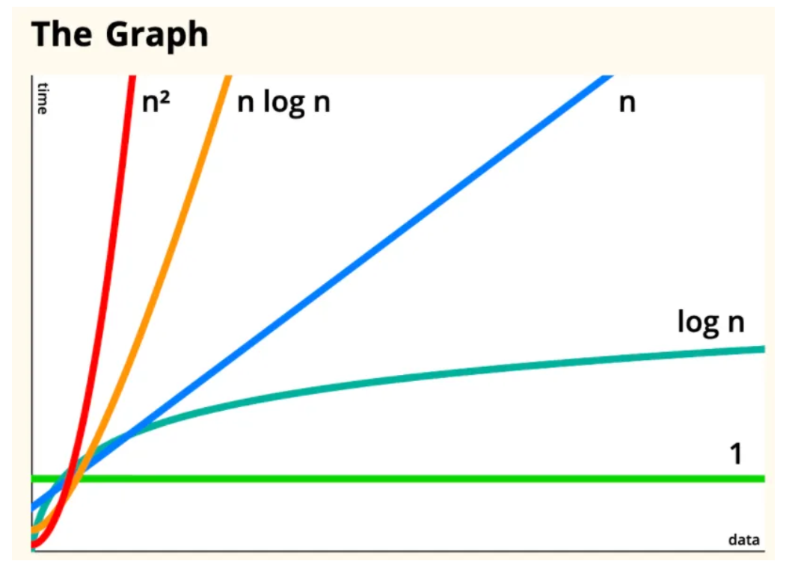

# Day18 요약 및 헷갈리는 개념

## 자료 구조

* 데이터를 R,W 어떤 구조로 했을 때 가장 적합한 방법인지 활용하기 위함.
    * ex) ArrayList, LinkedList, Tree, Map
    * R - 읽기, 찾기 W - 저장, 삭제, 변경



* O(1), O(n), O(n2)(버블정렬), O(n*logn)(퀵정렬), O(logn)
* n2 = n * n -> n * longn
    * n은 반복횟수이지만 n을 logn 으로 개선함으로써 성능을 향상시킴.
* 알고리즘 성능 개선
    * O(1)
    * O(n) -> O(logn)
    * O(n2) -> O(nlogn)

## 컬렉션 프레임웍

* 컬렉션 : 데이터를 모아 놓은 것
* 프레임웍 : 표준화된 프로그래밍 방식
* 컬렉션 프레임웍: 다수의 데이터를 다루기위해 표준화한 프로그래밍 방식

**List, Set, Map**

* List - 순서 O, 중복 O
    * Vector는 동기화 O, ArrayList는 동기화 X
    * Vector는 배열이며 값 하나는 Scalar, 값 여러개는 Vector라고 말함.
    * LinktedList, ArrayList
* Set - 순서 X, 중복 X
    * HashSet, TreeSet
* Map - (키 - 순서 X, 중복 X, 값 - 순서 X, 중복 O)
    * HashMap, TreeMap 주로 HashMap 사용
    * 순서 유지하고싶을 시에는 LinktedHashMath 사용

**ArrayList**

* 배열 요소 remove할 때 저장된 마지막 객체부터 배열을 삭제하자.

```java
for(int i=list.size()-1; i>=0; i--){
    list.remove(i);
}
```

## Tdd

1. given - 어떤 조건이나 상황이 주어졌을 때
2. test - 테스트 실행
3. assert - 결과확인