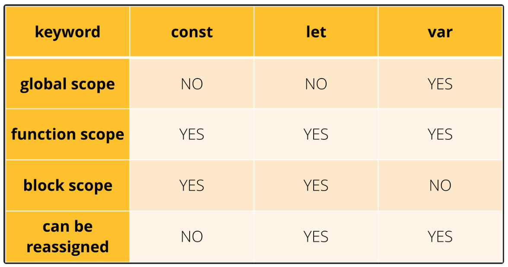

# Day31 요약

## javascript

**자료형**

* typeof 연산자로 변수나 리터럴 타입 확인 가능

* 기본형 자료형 6개 
    * number, string, boolean, null, undefined, symbol(es6)
* 참조형 자료형 2개
    * object, function

* 정적타입 : 컴파일시 타입결정 , 강타입
* 동적타입 : 실행중에 타입결정 , 약타입
    * js의 변수 타입은 동적으로 결정됨.

**호이스팅**

* 변수나 함수의 선언이 해당 범위에서 최상단으로 옮겨지는 것

```js

// 함수 선언식 호이스팅
helloWorld();

function helloWorld(){
    console.log('Hello World!')
}

// 함수 표현식 호이스팅
helloJs();

var helloJs = function(){
    console.log('Hello Js!')
}

// var 호이스팅
console.log(x);

var x = 10;

// let, const의 호이스팅
console.log(a);

let a = 3;

console.log(b);

const b = 3;
```

* 함수 선언식 호이스팅 : 컴파일 단계에서 메모리에 추가되어 함수 선언을 만나기전에 함수에 접근이 가능함 (자바스크립트 엔진이 helloWorld()를 마주치면, 엔진은 Lexical Environment 를 살펴보고 함수를 찾아서 실행함.)
* 함수 표현식 호이스팅 : **자바스크립트는 오직 선언만을 호이스팅하고, 초기화(할당)를 호이스팅하는 것은 아님.** 사용하고자 한다면 helloJs() 를 밑에서 호출해야함.
* var 호이스팅 : 컴파일 단계에서 변수, 함수 선언을 저장하고, 초기화는 호이스팅하지 않기에 에러가 안나고 결과는 undefined. 
* let, const 호이스팅 : 모든 선언(함수, var, let, const, class..)은 호이스팅되나 let과 const 선언은 uninitialized 오류가 발생함. const는 선언과 동시에 값을 할당해야함.

**정리**



1. var : 함수 레벨 스코프, 변수의 재선언 / 재할당 모두 가능, Hoisting 되어 변수를 선언하기 전에 참조할 수 있음.
2. let : 블록 레벨 스코프, 변수의 재선언은 불가능하나 재할당은 가능, 변수를 선언하기 전에 참조할 수 없으나, 변수를 선언할 시에 할당을 반드시 할 필요는 없음.
3. const : 변수의 재선언/재할당 모두 불가능하고, 변수를 선언하기 전에 참조할 수 없으며, 변수를 선언할 시 할당을 반드시 해야함

## HTML & CSS

**WEB**

* head : 문서에 대한 메타 정보
* body : 실제 내용
* DOM(document objext model) : 트리 구조로 이루어졌으며 문서를 조작하고 표준화된 방법
* html, css https://www.w3schools.com/ 하루에 한 개씩 보기
