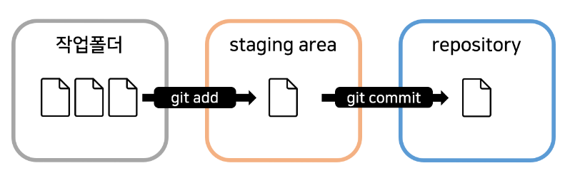

# GIT, GITHUB

* GITHUB GUI로 형상관리는 해보았으나 GIT으로 정리한 적이 없어 정리하고자함.

**GIT**

## Git 사용 add, commit

* Git이라는 버전관리 소프트웨어를 통한 형상관리 가능
* Git을 통해 작업한 코드들 기록, 보관가능, 과거 작업내용, 과거로 revert, pull, push 등등

**코드짤 작업용 폴더 생성**

* 터미널에서 작업할 작업용 폴더를 생성하여 아래와 같은 명령어 입력.
* 버전이 아무거나 뜨면 git 설치성공

```git
git --version
```

**git 유저 이름 셋팅**

```git
git config --global user.email "홍길동@naver.com"
git config --global user.name "홍길동"
```

* 컴퓨터에서 git을 처음 사용할 시에 터미널에 입력
* 누가 지금 git을 쓰고있는지 구분하기 위한 아이디 등록과 같은 것

**작업 폴더내 git 이용**

* 파일의 경로로 이동하여 git init 부터 입력하고 시작.
* 입력하면 git이 파일생성하는거, 코드작성하는걸 추적하게 해줌.
* 아래와 같이 사용.

```git
git init       
git add 파일명  
git commit -m '메세지내용'  
```

* git init 을 통해 git 생성
* text.txt 파일 생성 후 git add text.txt 명령어 입력
* git commit -m 'text.txt파일 생성 commit'

**용어 정리 staging area & repository**



* 버전 만들 때 git add, git commit 입니다.
* git add 하면 staging area로 이동.
* git commit 하면 repository 이동.
* 아래는 추가 명령어

```git
git add 파일명1 파일명2    // 여러 파일 동시 스테이징
git add .   // 전체 스테이징
git status
git restore     // 스테이징 파일 취소
git commit -m '메세지'
git log     // vim 에디터 j,k 위아래 스크롤, q로 종료
```

> 간단한 기능(회원가입 폼 레이아웃 같은) 추가 시 commit 주기가 제일 좋다.

## Git diff 사용

* commit 하기 전과 현재 코드의 차이를 보여주는 명령어 git diff

```git
git diff 커밋id     // 과거의 특정 commit과 비교
git difftool    // diff 보다 비주얼적으로 더 보기 좋게 보여준다.
```

* git diff 별로면 git graph 부가 기능을 통해 볼 수도 있습니다.

## Git branch 사용

* Git branch 왜 쓰는지에 대해 먼저 알아보고자한다.
* 커밋하면서 계속 코드 짜다보면 새로운 기능 추가하고, 수정한다. 원본파일에 바로 작업해도 되겠지만 혹시나 코드가 꼬이거나 망가지거나 할 경우 프로젝트의 복사본을 만들어 개발해야한다.
* 이를 위해 git 안에서 branch 기능을 사용해 복사본을 만들어 작업한다.(아래 그림과 같이)


```git
git branch 브랜치이름   // 프로젝트 사본 생성
git switch 브랜치이름   // 만든 브랜치로 이동 (checkout과 같음)
```

* 어떤 브랜치인지 확인할 떄는 git status를 자주 사용하자.


* coupon branch를 만들었다고 가정했을 떄 그림은 위와 같습니다.
* coupon branch에서 작업한 내용은 main branch와 아무런 영향이 없습니다.
* coupon branch에서 작업한 내용이 완벽하다할 때 원본코드가 있는 main 브랜치에 합치면 됩니다. 이 때 사용하는 것이 merge


```git
git switch main
git merge 브랜치명
```

* main 브랜치로 이동 후에 get merge coupon 하면 코드들이 main으로 합쳐진다.
* 충돌이 나는 경우에는 어떤 코드를 남길지 결정 후에(==== << >> // 이런거 지우고) 원하는 코드만 남기고 아래 명령어 사용

```git
git add 파일명
git commit -m '메세지
```

> 브랜치 생성 git branch 브랜치명, 이동 git switch 브랜치명, 합치기(main 이동 후) git merge 브랜치명, commit 내역 확인 git log --graph --oneline --all, 브랜치 합칠 때 충돌 발생 시 파일 열어서 수정 후 git add, git commit 하기

## Git Merge, Rebase 사용

**3-way merge**


* 브랜치에 신규 commit 이 있는 경우 위의 그림과 같이 합쳐진다.

**fast-forward merge**


* 기준이 되는 브랜치에 commit이 없을 경우에는 위의 그림과 같이 합쳐진다.
* 즉, 새로운 commit이 main브랜치가 되는 경우 fast-forward merge라고 한다.(branch가 사라지는 것은 아님)

**branch 삭제**

* merge 완료된 브랜치는 일반적으로 삭제하는데 이 때의 명령어는 아래와 같다.

```git
git branch -d 브랜치명
```

* merge 안한 브랜치 삭제는 아래와 같다.

```git
git branch -D 브랜치명
```

**git rebase**


* rebase는 브랜치의 시작점을 다른 commit으로 옮겨주는 행위이며
신규브랜치의 시작점을 main 브랜치 최근 commit으로 옮긴다음에 fast-forward merge 하는 것입니다.

```git
git rebase 중심브랜치명
git merge 새로운브랜치명
```

* 새로운 브랜치로 이동하여 위의 명령어 입력 후 중심브랜치로 이동하여 git merge 새로운브랜치명 입력한다.

## Git revert, reset, restore

**git restore**

* 특정 파일 하나 최근 커밋상태로 되돌려준다.

```git
git restore 파일명
git restore --source 커밋아이디 // 특정 commit시점 파일 복구
git restore --staged 파일명     // 특정 파일 staging 취소
```

**git revert**

* 특정 commit을 되돌리는 명령어
* commit 을 없애는 것은 아니고 commit 하나를 취소한 commit을 하나 생성하는 것


```git
git revert 커밋아이디1 커밋아이디2      // commit 여러개 취소 가능
git revert HEAD      // 최근 커밋 취소
```

* 에디터 뜨는 경우 i 눌러서 esc로 나오거나 글자 수청 후에 :wq 눌르면 커밋 메세지 저장.

**git reset**

* 과거로 모든걸 되돌리기(협업 시는 사용금지)


```git
git reset -hard 커밋아이디  
```

## git push 

* git은 버전관리 프로그램, git 파일이 기록해두는 장소가 repository 이다.(.git 숨김폴더가 repository)
* .git만 아니라 온라인 repository를 통해 고장방지, 협업을 위해 사용한다.

**GitHub 만들어서 사용하기**

* git init은 repository를 생성해주는 명령어
* git branch -M main 을 통해 main 브랜치 사용
* git add .
* git commit -m 'a만듬'

* 이렇게 만든 파일을 올려서 만들고 커밋한 내역을 원격저장소에 올리고 싶다?
 
 ```git
 git push -u 저장소주소 올릴로컬브랜치명
 ```

 * 위와 같이 명령어 입력해주면 된다.
 * git pull 하라고하면 git pull 해주면 된다.

 ```git
 git remote add origin 저장소주소
 ```

 * 저장소주소를 origin이라는 변수에 저장하는 명령어이다.

```git
git push -u origin 브랜치명 
```

* 터미널에 remote add 후 위의 명령어로 짧게 사용가능하다.
* 위의 -u 는 방금 입력한 주소를 기억하라는 뜻이다. -u 입력 후는 아래와 같은 명령어만으로 원격저장소 업로드가 가능하다.

```git
git push
```

**원격저장소에 있던거 그대로 내려받기**

```git
git clone https://원격저장소주소
```

* 원격저장소와 로컬저장소의 내용이 같지 않는데 push 하고자할 떄 에러가 발생한다.
* 이를 방지하기 위해서는 원격저장소의 내용을 먼저 pull 해야한다.
* git pull은 git fetch + git merge 명령어를 붙인 것
* git fetch : 원격저장소 신규 commit 가져오는 것
* git merge : 내 브랜치에 merge 하는 것

```git
git pull 원격저장소주소 브랜치명
```

**저장소에 올리지 않는 파일들을 .gitignore**

* 원격저장소를 효율적으로 쓰려면 사용하지 않는 node_modules, .env 파일과 같은 것들 스테이징되지 않게 만들어주는 gitignore 사용하자.

**원격저장소 branch 생성**

* 신기능을 만들고 싶을 때 main 브랜치에 코드 짜다가 망칠 수 있기 때문에 다른 브랜치를 만들어 개발합니다.


* 원격 repository에도 브랜치를 만들 수 있습니다.
* github에서 직접 만들거나, 로컬에서 만든 브랜치를 올릴 수 있습니다.

```git
git push 원격저장소주소 로컬브랜치명
```

* 위의 명령어를 통해 로컬 브랜치를 원격에 올릴 수 있습니다.

**pull request**

* 브랜치만들고 main과 merge 후 push 하는 과정이 일반적이나 merge하기 전에 토론하거나 검토하는 경우를 위해 pull request 기능이 있습니다.
* pull request 할 때는 세 가지 기능이 있는데 택 1하면 됩니다.

**create a merge commit**


* main 브랜치 조회시 합쳐진 브랜치의 commit 내역도 전부 나오는 3-way marge 를 실행합니다.

**squash and merge**


* 합쳐질 브랜치의 commit 내역을 하나로 합쳐서 main 브랜치에 신규 commit을 생성합니다.(commit 내역 X)

**rebase and merge**

* 합쳐질 브랜치를 main 브랜치 최신 commit으로 rebase 하고 나서 fast-forward merge 를 해줍니다.
* 위의 squash and merge와 비슷한데 합쳐질 브랜치의 commit 내역이 전부 보존되는 차이가 존재합니다.

## git stash

* git stash 를 사용하면 작성한 코드를 다른 보관함에 보관하여 사용할 수 있습니다.
* 주석처리와 용도가 비슷하나 기록이 commit에 남아 더러워지기에 주석처리한 내용 commit 하기 싫을 때 git stash 쓰면 유용합니다.
* 또는 간단히 브랜치 만들어서 보관하는 것도 괜찮.

```git
git stash   // 작업폴더 -> 임시보관함으로 이동
git stash save "bbb 망함"   // 메모도 가능
git stash list  // stash 코드 목록 출력
git stash pop   // git stash 했던 가장 최근 코드 불러오기
git stash drop 삭제할id
git stash clear
git stash -p    // 일부 코드만 git stash 하는 경우
```