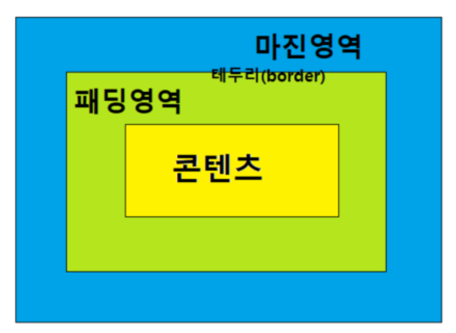

# HTML, CSS

## HTML, CSS 는 양이 많으니 중요한 것, 잘모르는 것 위주로 정리

### CSS 선택자

* id, 클래스, *, 태그 선택..

**속성선택자**

* input[type=text] : 특정 속성안의 값 일치 태그 선택
* input[type] : 특정 속성 태그 선택

**후손 선택자, 자손 선택자**

* div p : div의 후손에 위치하는 모든 p 태그
* #div h1, #div h2 : id가 div인 모든 h1, 모든 h2 태그
* div > p : div의 자손에 위치하는 모든 p 태그

**동위 선택자**

* div + p : div 바로 뒤에 위치하는 하나의 p 태그
* div ~ p : div 뒤에 위치하는 모든 p 태그

**반응 선택자**

* :active : 마우스로 클릭한 태그
* :hover : 마우스를 올린 태그

**상태 선택자**

* :checked : 체크 상태 input 태그
* :focus : 초점이 맞추어진 input 태그
* :enabled : 사용 가능한 input 태그
* :disabled : 사용 불가능한 input 태그

**구조 선택자**

* :first-child : 형제 관계에서 첫번쨰 위치하는 태그
* :last-child : 형제 관계에서 마지막에 위치하는 태그
* :nth-child(수열) : 형제 관계 앞에서 수열 번째 태그
* :first-of-type : 형제 관계에서 첫 번째로 등장하는 태그
* :nth-of-type(수열) : 형제 관계에서 수열 번째로 등장하는 태그


**문자 선택자**

* ::after : 태그 뒤에 위치하는 공간 선택
* ::before : 태그 앞에 위치하는 공간 선택
* ::selection : 드래그한 글자 선택

**링크 선택자**

* :link : href 속성을 가지고 있는 a 태그
* :visited : 방문했던 링크 가지고 있는 a 태그

**부정 선택자**

* :not : 선택자 반대 적용

### CSS 스타일 속성

**크기 단위**

* % : 백분율 단위
* em : 배수 단위
* px : 픽셀 단위

**가시 속성**

* display: none : 태그 화면에서 보이지 않게 만듬 (영역 X)
* display: block : 태그 block 형식 지정
* display: inline : 태그 inline 형식 지정 (width, height 적용 X)
* display: inline-block : 태그 inline-block 형식 지정 (width, height 적용 O)

* visibility: visible : 태그를 보이게 만듬
* visibility: hidden : 태그를 보이지 않게 만듬 (영역 O)
* visibility: collapse : table 태그를 보이지 않게 만듬

**박스 속성**



* margin : 현재 요소 주변의 여백 공간
* padding : 콘텐츠와 테두리 사이의 여백 공간
* border : 패딩과 마진사이의 테두리 공간
    * border-width, border-style, border-color (1px solid black)
    * border-radius : 테두리 속성 조절, 왼쪽위 오른쪽위 오른쪽아래 왼쪽 아래 (10px, 15px, 20px, 25px)

**위치 속성**

* position : static : 태그가 위에서 아래로 순서 배치 (default)
* position : relative : 초기 위치 상태에서 상하좌우 위치 이동
* position : absolute : 절대 위치 좌표
* position : fixed : 화면 기준 절대 위치 좌표 설정

* z-index : 숫자가 클 수록 앞에 위치
* overflow: hidden : 영역 벗어나는 부분 보이지 않게 만듬
* overflow: scroll : 영역 벗어나는 부분 스크롤로 만듬
* float: left: 태그를 왼쪽에 붙임
* float: right: 태그를 오른쪽에 붙임

**변형 속성**

* transition-delay : 이벤트 발생 후 몇 초후에 재생할지 지정
* transition-duration : 몇 초 동알 재생할지 지정
* transition-property : 어떤 속성 변형할지 지정

* animation-direction: alternate : from ~ to 이동 , to ~ from 이동 반복
* animation-direction: normal : 계속 from ~ to 이동

**긴 글자 생략**

```css
white-space: nowrap;
overflow: hidden;
text-overflow: ellipsis;
```

**직접 만든 로그인 참고**

* CSS 파일은 한 군데에서 관리

```css
@charset "UTF-8";

/*LoginForm*/
*{
	margin: 0;
	padding: 0;
	font-size: 15px;	
	font-family:  fonPretendard Variable,Noto Sans KR,Apple SD Gothic Neo,맑은 고딕,Malgun Gothic,sans-serif;
}
body{
	height: 100%;
}
.loginMainLayout{
	display: flex;
	flex-direction: column;
	padding: 50px 0;
}
.loginLayout{
	margin: 0 auto;
	align-items: center;
	text-align: center;
	max-width: 300px;
	padding: 40px 0;
}
.loginImg{
	margin-bottom: 10px;
	cursor: pointer;
}
.loginForm{
	width: 300px;
}
.loginInput{
	width: 100%;
	padding: 10px 12px 10px;
	border: 1px solid #dbdbdb;
	color: gray;
	box-sizing: border-box;
}
.loginBtn{
	max-width: 300px;
	width: 100%;
	padding: 15px 10px;
	margin: 20px 0;
	border: 1px solid transparent;
	font-size: 17px;
	font-weight: bold;
	background-color: deepskyblue;
	color: white;
	cursor: pointer;
}
.loginSection{
	cursor: pointer;
	text-align: center;
}
.loginSNSText{
	margin: 30px 0 15px;
	font-size: 14px;
}
.loginSNSImg{
	cursor: pointer;
}
a{
	text-decoration: none;
	color: inherit;
	font-size: 14px;
}
.loginNoMemberText{
	margin: 40px 0 10px;
	cursor: pointer;
}
.loginFooterLayout{
	text-align: center;
	font-family: sans-serif;
	color: #757575;
    font-size: 11px;
    margin: -5px 0 25px;
    box-sizing: border-box;
    height: 20px;
 	position : relative;
 	margin-top: 175px;
}

/*RegisterForm*/

```

```jsp
<%@ page language="java" contentType="text/html; charset=UTF-8"
    pageEncoding="UTF-8"%>
<!DOCTYPE html>
<html>
<head>
<meta charset="UTF-8">
<title>Insert title here</title>
<link rel="stylesheet" type="text/css" href="css/Style.css">
</head>
<body>

	<!-- 전체 컨테이너 layout -->
	<div class="loginMainLayout">
		<div class="loginLayout">
			
			<form action="" class="loginForm">
				<div class="loginItem idForm">
					<input type="text" placeholder="아이디" class="loginInput">
				</div>
				<div class="loginItem pwdForm">
					<input type="password" placeholder="비밀번호" class="loginInput">
				</div>
				<input type="submit" value="로그인" class="loginBtn">
			</form>
			<section class="loginSection">
				<a href="#" class="loginSections">비밀번호 재설정</a>
				<a href="Register.jsp" class="loginSections">회원가입</a>
			</section>
			<section class="loginSNS">
				<div class="loginSNSText">
					SNS계정으로 간편 로그인/회원가입
				</div>
				
				
			</section>
			<section class="loginNoMember">
				<div class="loginNoMemberText">
					비회원 주문 조회하기
				</div>
			</section>
		</div>
		<footer class="loginFooterLayout">
			<jsp:include page="module/Footer.jsp"/>
		</footer>
	</div>
</body>
</html>
```

* Footer.jsp

```jsp
<%@ page language="java" contentType="text/html; charset=UTF-8"
    pageEncoding="UTF-8"%>
<!DOCTYPE html>
<html>
<head>
<meta charset="UTF-8">
<title>Insert title here</title>
</head>
<body>
@bucketplace, Co., Ltd.
</body>
</html>
```

**직접 만든 회원가입 참고**

**직접 만든 홈페이지 레이아웃 참고**

**직접 만든 게시판참고**