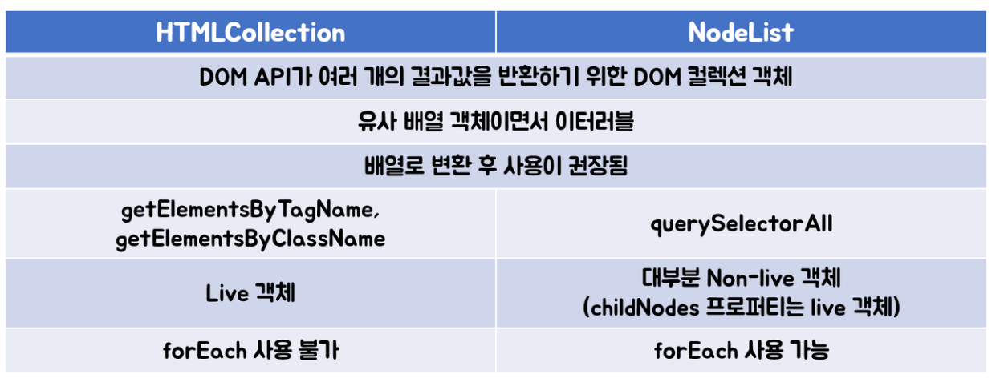

# 자바스크립트

## 모던 자바스크립트 Deep Dive 책 참고

**데이터타입**

* numer, boolean, string, null, undefined, symbol, function, object 8개의 데이터 타입을 가짐.
* typeof 연산자로 변수나 리터럴 타입 확인 가능.

```javascript
let integer = 10;
let double = 10.12;
let negative = -20;

// 숫자 타입은 모두 실수 처리
console.log(1 == 1.0)   // true
console.log(1 === 1.0)  // true

parseInt("123px")   // 123
parseInt(true)  // NaN
Number(true)    // 1
Number("true")  // NaN
String(123 + "")    // '123'
Boolean("0")    // true
Boolean(0)  // false
Boolean(123)    // true
!!123   // true
```

* 자바스크립트는 모두 숫자 타입임.

**템플릿 리터럴**

```javascript
let first = 'ES';
let two = '5';
console.log('ES5표기 방법 - ' + first + ' ' + two)

let es6First = 'ES'
let es6Two = '6'
console.log(`ES6표기 방법 - ${es6First} ${es6Two}`)
```

**연산자**

```javascript
typeof -'10'    // number
typeof +true    // number
7 + '5'     // 75
7 - '5'     // 2
"abc" - 3   // NaN
1 + true    // 2
1 + false   // 1
1 + null    // 1
10 ** 3     // 1000
0.2 * 10    // 2
102.124.toFixed(1)  // 102.1 (소수점 반올림)
"2" > "12"     // true (String 끼리의 사전 순서)
2 > "12"        // false (숫자로 변환됨)
undefined == null   // true
NaN === NaN     // NaN은 자신과 일치하지 않는 유일한 값
2 % 2 ? '홀수' : '짝수' // 짝수  (0은 false로 변환됨) 
typeof NaN  // number
```

* null 타입 확인 시는 === 사용, typeof 의 결과는 object 이기 때문
* NaN은 자신과 일치하지 않는 유일한 값
* +연산자는 피연산자 중 하나 이상이 문자열인 경우 문자열 연결 연산자로 동작함.

**단축평가**

```js
true || 'any'   // true
false || 'any'  // 'any'
true && 'any'   // 'any'
false && 'any'  // false
```

* && 논리곱 연산의 결과는 두 번째 피연산자가 결정
* || 논리합 연산의 결과는 첫 번째 피연산자가 결정

**배열**

```js
let arr = [1,2,3,4,5];
arr[6] = 100
console.log(arr)    // 1,2,3,4,5,empty,100
console.log(arr[5]) // undefined

// 배열내 요소 찾기, toString
var ages = [10, 20, 30, 40, 50]

function checkAdult(ages){
    return ages >= 18;
}

console.log(ages.find(checkAdult));     // 20
console.log(ages.filter(checkAdult));   // 20,30,40,50
console.log(ages.toString())            // 10,20,30,40,50

// 배열 요소 추가 삭제
var fruits = ["banana", "apple", "grape"]
fruits.push("lemon")
fruits.pop('apple')
console.log(fruits)     // ['banana', 'apple', 'grape']

fruits.splice(0,2)
console.log(fruits)     // ['grape']

delete fruits[0]
console.log(fruits)     // empty

// 배열 정렬, 뒤집기, 채우기, 합치기
var fruits = ["banana", "apple", "grape", 'mango']
console.log(fruits.sort())      // ['apple', 'banana', 'grape', 'mango']
console.log(fruits.reverse())   // ['mango', 'grape', 'banana', 'apple']

var numbers = [40, 100, 1, 5, 20, 50]
console.log(numbers.sort(function(a,b) {return a-b}))   // [1, 5, 20, 40, 50, 100]
console.log(numbers.sort(function(a,b) {return Math.random() - 0.5}))   // [20, 40, 100, 1, 5, 50] (shuffle 기능)

numbers.fill(1)
console.log(numbers)    // [1, 1, 1, 1, 1, 1]

var bigArr = fruits.concat(numbers)
console.log(bigArr)     // ['mango', 'grape', 'banana', 'apple', 1, 1, 1, 1, 1, 1]

// 2차원 배열 안에 담기
var arr = [];
var arr2 = [];

for(var i=0; i<25; i++){
    arr[i] = i+1
}
console.log(arr)

for(var j=0; j<5; j++){
    arr2[j] = arr.splice(0,5)
}
console.log(arr2)

// for문 while문
var person = {fname : 'park', lname : 'jin', age : '29'};
var text = ''

for(var x in person){
    text += person[x] + ' '
}

console.log(text)       // park jin 29 

var car = ["BMW", "Volvo", "Ford"]
var test = ""

for(var i=0; i < car.length; i++){
    test += car[i] + " "
}
console.log(test)       // BMW Volvo Ford 

var test2 = ""
```

**함수**

* 함수는 항상 값을 반환함.

```js
var add = function(a,b) {
            return a+b;
        }
console.log(add(3,5));

// 함수 즉시 호출 표현식 (익명함수이며 일회용임)
var result = (function(a,b) {return a+b})(3,5)
console.log(result)

// ES6 화살표 함수
var add = (a,b) => a + b
console.log(add(3,5))

// arguments 객체
function findMax(a,b){
    var i;
    var max = -Infinity

    console.log(arguments)

    for(i=0; i < arguments.length; i++){
        if(arguments[i] > max){
            max = arguments[i]
        }
    }
    return max;
}

var result = findMax(2,6,4,7,1);
console.log(result)
```

**클로져**

* 렉시컬 스코프란 **함수를 어디에서 호출했는지가 아닌 어디서 정의했는지에 따라 상위 스코프를 결정하는 것**
* 반환된 내부함수가 자신이 선언됐을 때의 환경인 스코프를 기억하여 자신이 선언됐을 때의 환경(스코프) 밖에서 호출되어도 그 환경에 접근할 수있는 함수.
* 함수와 그 함수가 선언됐을 때의 렉시컬 환경과의 조합.
* **자신이 생성될 때의 환경을 기억하는 함수**
* **내부함수를 반환하여, 외부에서 호출할 수 있도록 변경**.
* **외부 함수보다 중첩 함수가 더 오래 유지되는 경우 중첩 함수는 이미 생명 주기가 종료한 외부 함수의 변수를 참조**
* **상태를 안전하게 은닉하고 특정 함수에게만 상태 변경을 허용하기 위해 사용**. (자바의 접근 제어자 private 라 생각하자.)

```js
function closure(){
    var cnt = 0;

    return function(){
        cnt++;
        console.log(cnt)
    }
}

var f = closure();
f();    // 1
f();    // 2
f();    // 3
```

**객체**

```js

// 객체 생성 방법
// 1. 빈 객체 생성 후 , 멤버 추가
var person = {};
        
person.firstName = "John";
person.lastName = "Doe";
person.age = 50;
person.eyeColor = "blue";
person.sayHello = function(){
    console.log('Hi my name is '+this.firstName)
}

console.log(person) // {firstName: 'John', lastName: 'Doe', age: 50, eyeColor: 'blue'}
console.log(person.firstName)   // John
console.log(person['firstname]) // John
person.sayHello();

for(var x in person){
    console.log("x : ", x)  // key값
    console.log("person[x] : ", person[x])  // value값
}

// 2. 객체 생성 후 동시 멤버 추가
var myObject = {
    favoriteFruit: "Apple",
    favoriteNum : 5,
    favoriteHobby : "golf",
    introduce: function(){
        return this.favoriteFruit + " " + this.favoriteHobby
    },
    hi(){
        console.log('Hi ' + this.favoriteFruit)
    }
}

console.log(myObject.favoriteFruit)     // Apple
console.log(myObject.introduce())   // Apple golf
console.log(myObject.hi())  // Hi Apple (ES6 메서드 축약 표현)

// 3. 생성자 객체 정의
function Person1(name, age){
    this.name = name;
    this.age = age;
}

var obj = new Person1("Javascript", "100")
obj.toString = function(){
    return "name=" + this.name + ", age=" +this.age
}
console.log(obj)    // Person1 {name: 'Javascript', age: '100', toString: ƒ}
console.log(obj.toString()) //name=Javascript, age=100
```

* 같은 생성자로 생성한 객체라도 서로 다른 함수를 가질 수 있음.
* 프로퍼티 키를 중복 선언하면 나중에 선언한 프로퍼티가 먼저 선언한 프로퍼티를 덮어씀.

**Prototype (프로토타입)**

* 객체는 자신을 생성한 생성자의 prototype에 대한 참조인 __proto__와 constructor 속성을 자동으로 갖음.
* js는 프로토타입을 기반으로 상속을 구현함.

```js
function Person(name, age){
    this.name = name;
    this.age = age;
}

var obj = new Object();
var p = new Person("David", 10);
var s = new String();

console.log(Object.prototype===obj.__proto__)   // true  
console.log(String.prototype===s.__proto__)    // true
console.log(obj.constructor===Object)   // true
console.log(p.constructor===Person)     // true

var obj = new Object();
var obj2 = new Object();

console.log(obj.__proto__ === obj2.__proto__)   // true
console.log(obj2.__proto__ === Object.prototype)    // true

Object.prototype.getName = function(){
    return this.name
}

obj.name = "aaa"
obj2.name = "bbb"

console.log(obj.getName())  // aaa
console.log(obj2.getName()) // bbb
```

**this**

* 함수를 호출하는 객체를 의미함.

```js
function Person5(name, age){
    this.name = name;
    this.age = age;
    console.log("[" + this.name + ", " + this.age + "]")    
}

var p = Person5("홍길동", 20)   // [홍길동, 20]
var p2 = Person5("강감찬", 25)

console.log(p)  // Person5 {name: '홍길동', age: 20}
console.log(p2) // undefined

var p3 = {};
var p4 = new Object();

Person5.call(p3, "Sebin", 11);      //[Sebin, 11]
Person5.apply(p4, ["Yebin", 16]);   //[Yebin, 16]
```

**스프레드문법**

```js
console.log(...[1,2,3]) // 1 2 3

let arr = [1,2,3]
console.log(Math.max(...arr))   // 3

function foo(...rest){
    console.log(rest)
}

foo(...arr)
```

* ES6에 도입된 스프레드문법 ...은 하나로 뭉쳐 있는 여러 값들의 집합을 개별적인 값들의 목록으로 만듬.
* 여러 개의 값이 하나로 뭉쳐 있는 배열과 같은 이터러블을 펼쳐 개별적인 값들의 목록을 만듬.
* 이터러블이 아닌 일반 객체는 스프레드 문법의 대상이 될 수 없음.
* 스프레드 문법의 결과는 값이 아님.

```js
let concatArr = [...[1, 2], ...[3, 4]]
console.log(concatArr)  // [1,2,3,4]
```

* ES5에서는 배열을 concat으로 결합하였으나 스프레드 문법을 사용하면 별도의 메서드 없이 결합 가능.

```js
// 배열 추가
// ES5 splice 
let arr1 = [1,2,3,8,9]
let arr2 = [4,5,6,7]
arr1.splice(2, 0, arr2)

console.log(arr1)       // [1, 2, Array(4), 3, 8, 9]

// ES6 splice 
let es6Arr1 = [1,2,3,8,9]
let es6Arr2 = [4,5,6,7]
es6Arr1.splice(3, 0, ...es6Arr2)

console.log(es6Arr1)    // [1, 2, 3, 4, 5, 6, 7, 8, 9]

// 배열 복사
// ES5 slice
let arr1 = [1,2,3];
let es5copy;

es5copy = arr1.slice();
console.log(es5copy)

// ES6 slice
let e6copy;

e6copy = [...arr1];
console.log(e6copy);

```

* 배열의 기존 요소를 삭제 또는 교체, 추가하여 원본 배열의 내용을 변경함.
* ES5 에서 splice를 위와 같이 사용하면 배열안에 배열이 들어감.
* 배열 중간에 다른 배열을 추가하거나 삭제할 때 splice와 스프레드 문법을 사용하자.

```js
// 유사 배열 객체 -> 배열 변경 
let arrayLike = {
    0: 1,
    1: 2,
    2: 3,
    length: 3
};

// const arr = [...arrayLike]
console.log(arrayLike)      // Object
console.log(Array.from(arrayLike))  // Array
```

* 이터러블이 아닌 유사 배열 객체를 배열로 변경하려면 ES6에서부터 Array.from 메서드를 사용함.

```js
// 객체 내부 스프레드 문법 사용
// 객체 복사(얕은 복사)
let obj = { x: 1, y: 2}
let copy = { ...obj }

console.log(obj)
console.log(copy)
console.log(obj === copy)

// 객체 병합
let merged = { ...obj, ...{c : 3, d : 4} }
console.log(merged)
```

* 스프레드 문법의 대상은 이터러블이어야 하지만 일반 객체를 대상으로도 사용이 가능함.
* 얕은 복사이기에 비교 연산자는 false
* 스프레드문법으로 객체를 병합하기전에는 Object.assign 메서드를 사용했음.

**DOM 요소**

* document.getElementById
* document.getElementsByTagName
* document.getElementsByClassName
* document.getElementsByName
* document.querySelectorAll
* document.querySelector

**DOM요소 변경**

* element.innerHTML
* element.style.css
* element.setAttribute

**DOM요소 생성**

* document.createElement
* document.createTextNode
* element.innerHTML
* element.textContent 

**DOM요소 삭제**

* element.appendChild
* element.removeChild
* element.replaceChild
  
```html
    <div id="div">
        
    </div>

    <div class="divs">
        <div class="divs">
            
        </div>
    </div>

    <div name="divsname">
        
    </div>
    
    <div name="divsname">
        
    </div>

    <ul>
        <li>목록1</li>
        <li>목록2</li>
        <li>목록3</li>
    </ul>

    <span></span>
    <span></span>
    <p></p>
```  

```js
// DOM document.getElementById
let divId = document.getElementById('div')
let ul = document.createElement('ul');
let li = document.createElement('li');
let text = document.createTextNode('Hello World')

ul.appendChild(li);
li.append(text)
divId.appendChild(ul)

// divId.onclick = clicked
divId.addEventListener('click', clicked)

function clicked(){
    console.log('click!!!')
    divId.remove();
}

// DOM document.getElementBytagName
let arr = []
let liTag = document.getElementsByTagName('li')

for(let i=0; i<liTag.length; i++){
    let liTags = liTag[i].textContent;
    arr.push(liTags)
}

// DOM document.querySelectorAll
let querySelectAll = document.querySelectorAll('li')

let arr2 = Array.from(querySelectAll)
let arr3 = arr2.map(r => r.textContent) // 모든 li에 있는 text들 꺼내옴
```

**HTMLCollection, NodeLIst**

* DOM 요소를 다루다 dir 을 확인하다보니 HTMLCollection , NodeList 가 보여도 무지성으로 배열로 변경하여 사용하곤 했는데 정확한 의미를 알고싶어 정리하고자함.



* getElementsByTagName, getElementsByClassName 는 HTMLCollection DOM 컬렉션 반환
* querySelectorAll은 NodeList DOM 컬렉션 반환
* HTMLCollection은 노드의 상태 변화를 실시간 감지, NodeList는 정적으로 관리
* childNode가 리턴한 NodeList는 정적임이 보장되지 않음.
* 따라서 HTMLCollection 이나 NodeList를 그대로 사용할 때는 Array로 치환하여 사용하면 좋음.


**배열과 유사배열**

* 위에서 알아본 HTMLCollection, NodeList 은 유사배열이고 array는 배열임.
* 배열과 유사배열을 구분하는 이유는 유사배열의 경우는 배열의 메서드를 사용할 수 없기 때문임.

```html
let array = [1,2,3]
let querySelectAll = document.querySelectorAll('li')
let els = document.body.children

console.log(querySelectAll) // NodeList
console.log(els)    // Collection

console.log(Array.isArray(array))   // true
console.log(Array.isArray(querySelectAll))  // false
console.log(Array.isArray(els)) // false

// 배열
array.forEach(n => {
    console.log(n)
})

// 유사배열
let array2 = [...querySelectAll]

array2.forEach(e => {
    console.log(e)
})
```