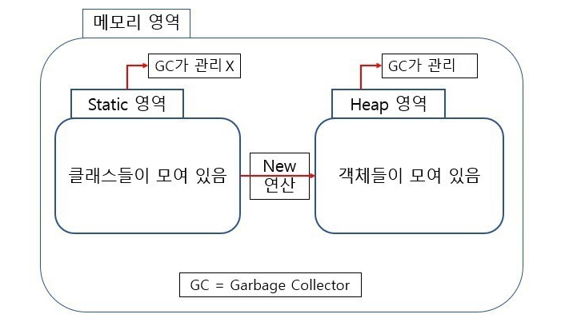
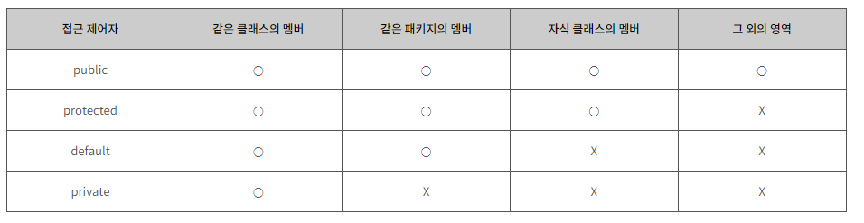
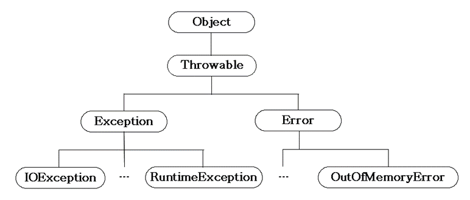
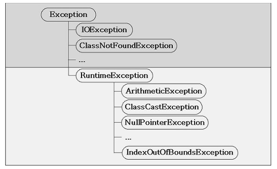
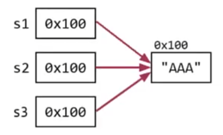

# 부트캠프전 자바의 정석 예습

## 1~5장은 반복문, 조건문, 배열이라 짧게 보고 알고리즘 문제 풀이, 6장 객체지향부터는 2번씩 보고 README 정리. 2번씩 보고 완벽히 이해했으면 Spring 공부 및 토이 프로젝트 진행

<details>
<summary style="font-size:20px">객체 지향 개념</summary>
<div markdown="1">

### 객체 지향 언어

* 코드의 재사용성이 높음 
* 유지보수에 용이

* OOP특징 4가지
  * 캡슐화 
  * 상속
  * 추상화
  * **다형성**

> 특징 4가지의 세부적인 사항은 따로 note에 정리해두자.

* 클래스 정의 : 객체를 정의해 놓은 것.
* 클래스 용도 : 객체를 생성하는데 사용, 클래스는 단지 객체를 생성하기위함.
* 객체 : 실제로 존재하는 것, 인스턴스 변수들의 묶음
* 객체 용도 : 객체가 가지고 있는 기능과 속성에 따라 다름.
  * ex) 클래스 : 제품 설계도, 객체 : 제품

### 객체

* 객체 = 속성(변수) + 기능(메서드)
  * ex) TV를 예로 들었을 경우, 채널 : int channel, 채널 높이기 : channelUp() {...} 

* 클래스로부터 객체를 만드는 과정 : 인스턴스화
* 그 클래스로부터 만들어진 객체 : 해당 클래스의 인스턴스

* TV설계도를 예로 들어보자.
  
```
클래스명 변수명;            // 객체 참조를 위한 참조변수
변수명 = new 클래스명();    // 클래스의 객체를 생성했음. 객체의 주소를 참조변수에 저장

Tv tv;
tv = new Tv();
``` 

### 객체배열 

* 객체배열은 참조변수 배열이라고도함

```
Tv[] tvArr1 = new Tv[3];              // tvArr1 참조변수의 객체 주소 생성

for(int i=0; i<tvArr1.length; i++) {  
			tvArr1[i] = new Tv();
}
```

* tvArr1[0], tvArr1[1], tvArr1[2] 참조변수 세 개를 배열로 만듬.

### 선언위치에 따른 변수의 종류

* 변수는 총 세가지
  * 인스턴스 변수 - 클래스 영역에 선언, 인스턴스를 생성할 때 만들어짐.
  * 클래스 변수 - static 변수라고도하며, 공통된 저장공간을 공유함. **클래스명.클래스 변수** 사용. 클래스가 메모리에 올라갈 때 만들어짐.
  * 지역 변수 - 메서드 영역에 선언되어 메서드 내에서 {} 블럭내에서 사용하며, 메서드 종료시 사라짐. 변수 선언문이 수행되었을 때 만들어짐.

### 클래스 변수와 인스턴스 변수

```java
public class Card {
	String kind;        // 인스턴스 변수 무늬 kind
	int num;            // 인스턴스 변수 숫자 num
	
	static int weight;  // 클래스 변수 너비 weight
	static int height;  // 클래스 변수 높이 height
}
```

* 카드를 예로 들어보자.
  * Card 인스턴스는 자신만의 무늬와 숫자를 가지고 있음.
  * 각 카드의 너비와 높이는 공통적으로 같은 값을 가져야하므로 클래스 변수로 설정.
  * 카드의 너비와 높이를 변경하는 경우 한 카드의 클래스 변수 weight, height 만 변경하면됨.

> 공통 속성은 클래스 변수(static), 개별 속성은 인스턴스 변수(클래스 객체 생성)

### 메서드 

* 간단하게 코드의 중복을 제거하기위해 문장들을 묶은 것.
* 값(입력)을 받아서 처리하고, 결과를 반환(출력) 하는 역할.

```java
반환타입 메서드이름(타입 변수명, 타입 변수명, ...){
  // 실행코드...
}

int add(int a, int b){
  int result = a + b;
  return result;
}
```

* 매개변수 a, b는 0~n개의 해당하고 출력은 0~1개에 해당함. void인 경우에는 출력값이 없을 수 있음.
* 선언부는 int arr .. 에 해당하고 구현부는 실행코드에 해당함.

> 메서드는 클래스 영역에만 사용가능.

#### 정리



* Class는 Static 영역에 생성, new 연산을 통해 생성한 객체는 Heap영역에 생성됨.
* 객체를 통해 생성한 Heap영역에 있는 메모리는 GC에 의해 수시로 관리를 받으면서 사용하지 않으면 제거됨.
* 하지만 Static은 공통으로 사용한다는 점에서 유리한 이점을 가지고 있지만, GC관리 영역 밖에 있으므로 프로그램 종료시까지 메모리가 유지됨.
  * -> 이는 시스템의 퍼포먼스에 악영향을 미침. 그러므로 Static은 꼭 필요한 경우 사용해야함.

</div>
</details>

<details>
<summary style="font-size:20px">호출스택, 매개변수</summary>
<div markdown="1">

### 호출스택

* 호출스택 : 메서드 수행에 필요한 메모리가 제공되는 공강
* stack의 동작원리, LIFO LastInFirstOut 택배가 쌓이듯이 차례로 호출이 쌓이면 맨 위에서 차례로 제거됨.

* main() 이 println() 호출 과정
  1. main이 호출 (main 메서드 실행상태)
  2. main 메서드가 println을 호출하면 main 메서드 위에 println이 올라감. (main 대기상태 , println 실행상태)
  3. println이 종료되면 스택에서 제거되고 main 메서드로 돌아옴.(main 실행상태)
  4. 실행할 메서드가 없으므로 main도 제거됨. 

> 스택에 대해서는 note에 따로 정리해두자.

### 기본형 매개변수, 참조형 매개변수

* 매개변수의 타입이 기본형일 때는 기본형 값이 복사되지만, 참조형일 경우는 인스턴스의 주소가 복사됨.
* 기본형 매개변수 - 변수의 값을 읽기만 할 수 있음.
* 참조형 매개변수 - 변수의 값을 읽고 변경할 수 있음.

#### 기본형 매개변수 예제

```java
class Data{
	int x;
}

public class PrimitiveType {
	public static void main(String[] args) {
		Data d = new Data();
		d.x = 10;
		System.out.println("main() : x = " + d.x);
		
		change(d.x);
		System.out.println("After change(d.x)");
		System.out.println("main() : x = " + d.x);
	}

	static void change(int x) {   // 기본형 매개변수
		x = 1000;
		System.out.println("change() : x = " + x);
	}
}
```

```
main() : x = 10
change() : x = 1000
After change(d.x)
main() : x = 10
```

* change 메서드 호출되며 d.x 가 change메서드의 매개변수 x에 복사됨.
* change 메서드에서 x의 값을 1000으로 변경.
* change 메서드가 종료되면서 매개변수 x는 스택에서 제거.

> d.x의 값이 변경된 것이 아니라 change 메서드의 매개변수 x의 값이 변경된 것임.

#### 참조형 매개변수 예제

```java
class Data2{
	int x;
}

public class ReferenceType {
	public static void main(String[] args) {
		Data2 d = new Data2();
		d.x = 10;
		System.out.println("main() : x = " + d.x);
		
		change(d);
		System.out.println("After change(d)");
		System.out.println("main() : x = " + d.x);
	}

	static void change(Data2 d2) {
		d2.x = 1000;
		System.out.println("change() : x = " + d2.x);
	}
}
```

```
main() : x = 10
change() : x = 1000
After change(d)
main() : x = 1000
```

* change 메서드 호출되며 참조변수 d의 주소가 매개변수 d2에 복사됨.
* change 메서드에서 매개변수 d2로 x의 값을 1000으로 변경
* change 메서드가 종료되면서 매개변수 d는 스택에서 제거됨.

> 참조형 매개변수는 x값이 아닌 변수 d의 주소가 매개변수 d2에 복사됨.

### static 메서드, 인스턴스 메서드   

* static 이란 뭘까 ??
  1. 클래스 설계 시에 멤버변수 중 모든 인스턴스에 공통으로 사용하는 것에 static을 붙임.
  2. static이 붙은 변수(클래스변수) 는 클래스가 메모리에 올라갈 때 자동으로 생성되므로 인스턴스를 생성하지 않아도됨.
  3. 클래스 메서드는 인스턴스 변수를 사용할 수 없음. 반면에 인스턴스 메서드는 클래스 메서들르 사용할 수 있음.
  4. 매서드 내에서 인스턴스 변수를 사용하지 않는다면 static 붙이는 것을 고려함. (메서드 호출시간이 짧아지므로 성능 향상)

> 클래스의 멤버변수 중 모든 인스턴스에 공통된 값을 유지해야되는 것이 있음 -> static 고려해봄.
	
> 작성한 메서드 중에서 인스턴스 변수나 인스턴스 메서드를 사용하지 않음 -> static 고려해봄.

</div>
</details>

<details>
<summary style="font-size:20px">오버 로딩</summary>
<div markdown="1">

### 오버로딩

* 한 클래스 안에 같은 이름의 메서드를 여러 개 정의하는 것.
* 오버로딩 조건
  1. 매서드 이름이 같아야함
  2. 매개변수의 개수 or 타입이 달라야함
  3. 반환 타입은 관계없음.

```java
public class Overloading {

	public static void main(String[] args) {
		
		MyMath3 math3 = new MyMath3();
		System.out.println("math3.add(3, 3) 결과 : " + math3.add(3, 3));
		System.out.println("math3.add(3, 3L) 결과 : " + math3.add(3, 3L));
		System.out.println("math3.add(3L, 3) 결과 : " + math3.add(3L, 3));
		System.out.println("math3.add(3L, 3L) 결과 : " + math3.add(3L, 3L));
		
		int[] a = {100, 200, 300};
		System.out.println("math3.add(a) 결과 : " + math3.add(a));
	}
}

class MyMath3{
	int add(int a, int b) {
		System.out.print("int add(int a, int b) - ");
		return a+b;
	}
	long add(int a, long b) {
		System.out.print("long add(int a, long b) - ");
		return a+b;
	}
	long add(long a, int b) {
		System.out.print("long add(long a, int b) - ");
		return a+b;
	} 
	long add(long a, long b) {
		System.out.print("long add(long a, long b) - ");
		return a+b;
	}
	
	int add(int[] a) {
		System.out.print("int add(int[] a) - ");
		int rslt = 0;
		for(int i=0; i<a.length; i++) {
			rslt += a[i];
		}
		return rslt;
	}
}
```

```
int add(int a, int b) - math3.add(3, 3) 결과 : 6
long add(int a, long b) - math3.add(3, 3L) 결과 : 6
long add(long a, int b) - math3.add(3L, 3) 결과 : 6
long add(long a, long b) - math3.add(3L, 3L) 결과 : 6
int add(int[] a) - math3.add(a) 결과 : 600
```
 
> 동일한 기능을 하는 메서드를 하나의 이름으로 정의함으로써 오류를 줄여주고, 메서드의 이름만 보고 예측 가능함.

</div>
</details>

<details>
<summary style="font-size:20px">생성자</summary>
<div markdown="1">

### 생성자

* 인스턴스가 생성될 때 호출되는 인스턴스 초기화 메서드.
* 이름이 클래스 이름과 같아야함.
* 모든 클래스는 반드시 생성자를 가짐. (컴파일러가 생성자가 하나도 없을 떄 자동으로 만들어줌)
* 리턴 값이 없음.

```
클래스 이름(타입 변수명, 타입 변수명, ...){
    // 인스턴스 생성 시 수행될 코드
    // 주로 인스턴스 변수의 초기화 코드 적음.
}
```

```java
class Car{
	
	String color;
	String gearType;
	int door;
	
	Car(){
		System.out.println("기본 생성자 호출");
	}
	
	Car(String c, String g, int d){
		System.out.println("매개변수 생성자호출");
		color = c;
		gearType = g;
		door = d;
	}
}
public class Constructors {

	public static void main(String[] args) {
		
		Car car1 = new Car();
		
		car1.color = "white";
		car1.gearType = "auto";
		car1.door = 4;
		
		Car car2 = new Car("black", "auto", 2);
		
		System.out.println("car1 color = " + car1.color + ", car1 gear = " + car1.gearType + ", car1 door = " + car1.door);
		System.out.println("car2 color = " + car2.color + ", car2 gear = " + car2.gearType + ", car2 door = " + car2.door);
	}
}
```

```
기본 생성자 호출
매개변수 생성자호출
car1 color = white, car1 gear = auto, car1 door = 4
car2 color = black, car2 gear = auto, car2 door = 2
```

* car1 객체에는 기본 생성자를 생성, car2 객체에는 매개변수가 있는 생성자를 생성.
* 보통은 car2의 생성자를 객체로써 사용함.

#### 생성자 this

* 인스턴스 자신을 가리키는 참조변수 

```java
Car(String color, String gearType, int door){
		this.color = color;
		this.gearType = gearType;
		this.door = door;
	}
```

* this.color 는 Car에서 정의한 인스턴스변수, String color는 매개변수로 지역변수에 해당함.
* 생성자의 매개변수로 인스턴스변수들의 초기값을 제공받는 경우가 많기 때문에 이렇게 쓰임.

```java
	Car(String c, String g, int d){
		color = c;
		gearType = g;
		door = d;
	}
```

* 위의 예제처럼 매개변수의 이름을 다르게 하는 것 보다 this를 사용해서 구별하는 것이 의미가 명확함.
</div>
</details>

<details>
<summary style="font-size:20px">상속</summary>
<div markdown="1">

### 상속

* 기존의 클래스로 새로운 클래스를 작성하는 것.
* 두 클래스를 부모와 자식으로 관계를 맺어주는 것.
* 상속을 통해 보다 적은 양의 코드로 새로운 코드를 작성하고, 공통적으로 관리하여 유지보수에 용이함.

```java
class 자식클래스 extends 부모클래스 {
	...
}

class Parent{
	...
}

class Child extends Parent{
	...	
}
```

* 상속해주는 클래스(Parent)를 부모 클래스라고 하고, 상속 받는 클래스(Child)를 자식 클래스라고함.
* 자식 클래스 Child는 부모 클래스 Parent를 포함할 수 있다고도함.
* 부모 클래스가 변경되면 자식 클래스는 영향을 받지만, 자식 클래스가 변경되는 것은 부모 클래스에 영향을 주지 않음.
* 자식 클래스는 부모 클래스의 모든 멤버를 상속받지만 생성자와 초기화 블럭은 상속되지 않음.
* 자식 클래스의 멤버 개수는 부모 클래스보다 항상 같거나 많음.

```java
public class Ex7_1 {

	public static void main(String[] args) {
		
		SmartTv stv = new SmartTv();
		stv.channel = 10;
		stv.channelUp();
		System.out.println(stv.channel);
		
		stv.displayCaption("자바의정석 상속 이 부분은 안나올거임");
		stv.caption = true;
		stv.displayCaption("자바의정석 상속");
	}
}

class Tv{
	
	boolean power;
	int channel;
	
	void power() {
		power = !power;
	}
	
	void channelUp() {
		channel++;
	}
	
	void channelDown() {
		channel--;
	}
}

class SmartTv extends Tv{
	
	boolean caption;
	
	void displayCaption(String text) {
		if(caption) {
			System.out.println(text);
		}
	}
}
```

* 자식 클래스의 인스턴스를 생성하면 부모 클래스의 멤버도 같이 생성되기 때문에 부모 클래스의 인스턴스 생성없이 사용가능함.

#### 상속은 언제 사용?

* 클래스를 설계할 때 상속을 쓰는 경우는 어떠한 경우가 있을까?

```java
//1
class Circle{
	Point c = new Point();
	int r;
}

class Circle extends Point{
	int r;
}
```

* 위의 경우를 보았을 때 Circle클래스를 작성할 때 Point클래스를 포함시키거나 상속받는거는 별 차이 없어보임.
* 이러한 경우 ~은 ~이다 (is a), ~은 ~을 가지고 있다 (has a) 을 활용하자.

> 원은 점이다 - Circle is a Point

> 원은 점을 가지고 있다. - Circle has a Point

* 원은 점을 가지고 있다. has a 관계가 더 어울리므로 이러한 경우는 상속보다는 포함관계가 더 알맞음.

* 상속관계 is a 인 경우 Car와 SportsCar 를 예로 들어보자.
* SportsCar는 Car이다. 라는 문장이 어울리는 경우 Car를 부모클래스로 두어 상속관계를 맺는 것이 알맞음.

* 자바에서는 단일 상속만을 허용함.
* 다중상속을 허용하면 복합적인 기능을 가진 클래스를 쉽게 작성할 수 있다는 장점이 있지만, 관계가 복잡해짐.
* 비중이 높은 클래스 하나만 상속관계로, 나머지는 포함관계로 작성함.

#### Object 클래스

```java
class Tv{

}

class Tv extends Object{

}

Tv tv = new Tv();

public static void main(String[] args) {
	tv.toString();
	tv.equals();
}

```

* 부모가 없는 클래스는 자동적으로 Object 클래스를 상속받음.
* 모든 클래스는 Object클래스에 정의된 11개의 메서드를 상속받음. (toString, equals 등등..)
* 상속계층도 최상위에는 Object 클래스가 위치함.

#### 참조변수 super

* super는 자식 클래스에서 부모 클래스로부터 상속받은 멤버를 참조하는데 사용되는 참조변수임.

```java
public class Super {
	
	public static void main(String[] args) {
		
		Child child = new Child();
		child.method();
	}
}

class Parent{
	int x = 10;
}

class Child extends Parent{
	int x = 20;
	
	public void method() {
		System.out.println("x = " + x);
		System.out.println("this.x = " + this.x);
		System.out.println("super.x = " + super.x);
	}
}
```

* 위의 예제와 같이 자식 Child 클래스는 부모 Parent 클래스로부터 x를 상속받는데, x값이 같아서 구분할 방법이 필요함.
* 이럴 때 부모 클래스의 멤버를 참조하는 경우 super 키워드를 사용함.

```java
public class Super {
	
	public static void main(String[] args) {
		
		Child child = new Child(1, 2, 3);
		System.out.println(child.toString());
		
		System.out.println();
		
		Parent parent = new Parent(5, 6);
		System.out.println(parent.toString());
	}
}

class Parent{
	int x, y;
	
	Parent(int x, int y){
		this.x = x;
		this.y = y;
		System.out.println("Super 생성자 호출");
	}
	
	public String toString() {
		return x + "," + y;
	}
}

class Child extends Parent{
	
	int z;
	
	Child(int x, int y, int z) {
		super(x, y);		// super(x,y) 는 매개변수가 있는 Parent 의 생성자를 호출함. Parent 기본 생성자가 있으면 this.x, this.y 사용 가능.
		this.z = z;
		System.out.println("Child 생성자 호출");
	}
	
	@Override
	public String toString() {
		return x + "," + y + "," + z; 
	}
}
```

```
Super 생성자 호출
Child 생성자 호출
1,2,3

Super 생성자 호출
5,6

```

* 자식 클래스인 Child에서 Parent로부터 상속받은 x,y를 초기화함.
* child 객체를 생성할 때 Child 생성자에서 super 호출을 통해 Parent의 생성자가 호출되며 Super생성자 호출, Child 생성자 호출이됨.
* child에서 오버라이딩한 toString을 통해 1,2,3 이 출력되고 생성자도 동일한 로직으로 호출이됨.

</div>
</details>

<details>
<summary style="font-size:20px">오버라이딩</summary>
<div markdown="1">

* 부모 클래스로부터 상속받은 메서드의 내용을 변경하는 것.
* 선언부는 바꾸지 못하고 구현부만 바꿀 수 있음.
* 오버라이딩 조건
  * 메서드의 선언부(메서드 이름, 매개변수, 반환타입)은 부모클래스와 자식클래스가 일치해야함.
  * 접근 제어자는 부모 클래스의 메서드보다 좁은 범위로 변경 할 수 없음.(부모가 protected 이면 자식은 protected or public 이어야함.)
  * 부모 클래스의 메서드보다 많은 수의 예외처리를 선언할 수 없음.

```java
public class Extends {

	public static void main(String[] args) {
		
		Point p1 = new Point();
		p1.x = 10;
		p1.y = 20;
		p1.getLocation();
		
		Point3D p2 = new Point3D();
		p2.x = 5;
		p2.y = 10;
		p2.z = 20;
		p2.getLocation();
		
		System.out.println(p1.getLocation());
		System.out.println(p2.getLocation());
		
	}
}

class Point{
	int x;
	int y;
	
	public String getLocation() {
		return "x : " + x + ", y : " + y;
	}
}

class Point3D extends Point{
	
	int z;
	
	@Override
	public String getLocation() {
		return "x : " + x + ", y : " + y + ", z : " + z;
	}
	
}
```

* Point3D는 Point로 부터 x,y 상속받고 getLocation() 메서드를 사용중임.
* 부모클래스에서 사용하는 getLocation() 메서드를 그대로 사용할 수도 있지만 자식 클래스에 변경하여 사용가능함.
* 왜 사용할까?
  * 부모클래스 Point 에서 getLocation 이 좌표를 가져다주는 기능을 사용했듯이 자식 클래스에서도 좌표를 문자열로 얻을 수 있다는 기대값이 있으므로 새로운 메서드를 제공하는 것 보다 오버라이딩을 통해 메서드의 기능을 유추하고 유지보수에 용이하다는 장점이 있음.

</div>
</details>

<details>
<summary style="font-size:20px">제어자, 접근제어자, 캡슐화</summary>
<div markdown="1">

### 제어자 

* 클래스와 클래스의 멤버(멤버 변수, 메서드)에 부가적인 의미 부여
  * 접근 제어자 - public, protected, (deault), private
  * 그 외 - static, final, abstract, native, transient, synchronized, volatile, stictfp

* 주로 클래스나 멤버변수와 메서드에 사용됨.
* 하나의 대상에 여러 제어자를 같이 사용가능하나 접근 제어자는 하나만 사용 가능함.
* 접근 제어자를 가장 왼쪽에 사용함.

#### static 

* 클래스의, 공통적인 이라는 의미를 가지고 있으며 인스턴스에 상관없이 같은 값을 가지고있음.
* 멤버변수, 메서드, 초기화 블럭에 사용됨.
* 클래스가 메모리에 로드될 때 생성됨.
* 인스턴스를 생성하지 않고도 사용 가능함.
* static 메서드 내에서는 인스턴스변수들을 직접 사용할 수 없다.
  * 인스턴스 변수는 객체가 생성되어야 사용가능한데 static은 객체 생성없이 사용 가능하여 호출시기가 다르기 때문임.

#### final

* 마지막의, 변경될 수 없는 의미를 가지고 있으며, 거의 모든 대상에 사용 가능함.
* 변수에 사용하면 변경할 수 없는 상수가 되며, 메서드에 사용하면 오버라이딩을 할 수 없고, 클래스에 사용되면 부모 클래스가 될 수 없음.

### 접근 제어자



* 접근 제어자는 멤버, 메서드, 생성자 또는 클래스에 사용되며 클래스를 외부에서 접근하지 못하도록 제한하는 역할을 함.

1. private - 같은 클래스 내에서만 접근이 가능함.
2. (deault) - 같은 패키지 내에서만 접근이 가능함.
3. protected - 같은 패키지 내에서, 그리고 다른 패키지의 자식클래스에서 접근이 가능함.
4. public - 접근 제한이 없음.

* public > protected > default > private 순으로 나열함. 
* 접근제한없음 > 같은 패키지 + 자식클래스 > 같은 패키지 > 같은 클래스

### 캡술화와 접근 제어자

* public protected, default, private 접근 제어자는 왜 사용할까?
  * **외부로부터 데이터를 보호하기 위함**
  * 외부에는 불필요한, 내부적으로 사용되는 부분을 감추기 위함

```java
public class Time{
	public int hour;
	public int minute;
	public int second;
}

public static void main (String[] args) {
	Time t = new Time();
	t.hour = 25;		// 멤버변수에 직접 접근이 가능함.
}
```

* 위의 예제로보면 멤버변수 hour는 0보다 같거나 크고 24보다 작은 범위의 같을 가져야함.
* 하지만 위의 코드에서 25로 잘못지정해도 막을 방법이 없기에 주로 private 제한하고 getter, setter로써 값은 가져옴.

```java
public class Time {

	private int hour;
	private int minute;
	private int second;
	
	public int getHour() {
		return hour;
	}
	public void setHour(int hour) {
		this.hour = hour;
	}
	public int getMinute() {
		return minute;
	}
	public void setMinute(int minute) {
		this.minute = minute;
	}
	public int getSecond() {
		return second;
	}
	public void setSecond(int second) {
		this.second = second;
	}
}
```

* get은 단순히 멤버변수의 값은 반환하며, set은 조건에 맞는 값일 때 멤버변수의 값을 변경함.
* **만일 상속을 통해 확장될 것이 예상되는 클래스인 경우는 private 대신 protected를 사용하는 것.**
* private 이 붙은 멤버는 자식 클래스에서도 접근이 불가능하기 때문임.

</div>
</details>

<details>
<summary style="font-size:20px">다형성</summary>
<div markdown="1">

### 다형성

* 여러 가지 형태를 가질 수 있는 능력.
* **부모 타입 참조 변수로 자식 타입 객체를 다루는 것.**

```java
class Tv{
	
	boolean power;
	int channel;
	
	void power() { power = !power; }
	
	void channelUp() { channel++; }
	
	void channelDown() { channel--; }
}

class SmartTv extends Tv{
	
	String text;
	boolean caption;
	
	void displayCaption(String text) {
		if(caption) {
			System.out.println(text);
		}
	}
}

	public static void main(String[] args) {
		
		// 다형성 미활용
		Tv t = new Tv();
		SmartTv stv = new SmartTv();
	}
```

* 다형성을 활용하기전에는 main에서 보듯이 인스턴스의 타입과 일치하는 타입의 참조변수만을 사용함.
* 부모는 부모의 인스턴스변수, 메서드를 사용, 자식은 부모, 자신의 인스턴스변수, 메서드에 접근하여 사용할 수 있었음.

* 다형성을 활용하면 아래와 같이 사용할 수 있음.
  
```java
public static void main(String[] args) {
		
		// 다형성 활용
		Tv tv = new SmartTv();
	}
```
* 부모 클래스의 타입 참조변수로 자식 클래스의 타입 인스턴스를 참조함.

#### 다형성 장점과 예제

```java
SmartTv stv = new SmartTv();
```

* 다형성을 사용하지 않았을 경우.
* SmartTv의 참조변수 객체 stv는 Tv의 기능 5개와 SmartTv 클래스 내에서의 기능 3개로 총 8개가 이용가능함.
  
```java
	//Tv
	boolean power;
	int channel;
	void power() { power = !power; }
	void channelUp() { channel++; }
	void channelDown() { channel--; }
	
	//SmartTv
	String text;
	boolean caption;
	void displayCaption(String text) {
		if(caption) {
			System.out.println(text);
		}
	}
```

```java
Tv tv = new SmartTv();
```

* 다형성을 사용했을 경우
* 부모클래스의 참조변수 객체 tv로 SmartTv 의 인스턴스를 만들었을때 인스턴스 기능은 8개지만 Tv의 기능 5개만 사용가능함.

#### 다형성 예제

```java
class Coffee {
    int price;

    public Coffee(int price) {
        this.price = price;
    }
}

class Americano extends Coffee {
    public Americano() {
        super(4000); // 상위 메서드 생성자 호출
    }
    // Object 클래스 toString() 메서드 오버라이딩
    public String toString() { 
        return "아메리카노";
    }
}

class CaffeLatte extends Coffee {
    public CaffeLatte() {
        super(5000);
    }
    // Object 클래스 toString() 메서드 오버라이딩
    public String toString() {
        return "카페라떼";
    }
}

class Customer {
    int money = 50000;

    // 커피 구매 메서드(다형성 활용)
    void buyCoffee(Coffee coffee) {
        if (money < coffee.price) {
            System.out.println("잔액이 부족합니다.");
            return;
        }
        money -= coffee.price;
        System.out.println(coffee + "를 구매하였습니다.");
    }

    /* 아메리카노, 카페라떼 구매 메서드를 따로 구현하지 않아도 됨
    void buyCoffee(Americano americano) {
        money -= americano.price;
    }

    void buyCoffee(CaffeLatte caffeLatte) {
        money -= caffeLatte.price;
    } */
}
```

* 개별적인 커피 구매 메서드를 따로 구현하지 않아도, 상위 클래스의 Coffee의 자료형만 매개변수로 받아 사용가능함.
* 밑의 예제를 하나 더 알아보자.
 
### 매개변수의 다형성

* 참조형 매개변수는 메서드 호출시, 자신과 같은 타입 또는 자식타입의 인스턴스를 넘겨줄 수 있음.

```java
public class Tv1 extends Product{
	
	public Tv1() {
		super(100);
	}
	
	public String toString() {
		return "tv";
	}
}

public class Buyer {

	int money = 1000;
	int bonusPoint = 0;
	
	void buy(Product p) {
		
		if(money < p.price) {
			System.out.println("잔액이 부족하여 물건 구매X");
			return;
		}
		money -= p.price;
		bonusPoint += p.bonusPoint;
		System.out.println(p + "을/를 구입하셨습니다.");
	}
}

public static void main(String[] args) {
	Buyer customer1 = new Buyer();

	customer1.buy(new Tv1());

	System.out.println("customer1 현재 남은 돈은 " + customer1.money + " 만원 입니다.");
	System.out.println("customer1 현재 보너스 점수는 " + customer1.bonusPoint + " 점 입니다.");
}

```

```
tv을/를 구입하셨습니다.
customer1 현재 남은 돈은 900 만원 입니다.
customer1 현재 보너스 점수는 10 점 입니다.
```

* 구매자 cutomer1을 객체로 만들어 cutomer1이 buy 메서드를 사용하고 있는 예제.
* customer1.buy(new Tv1()); 의 의미는 아래와 같음.
  * Product p = new Tv1();
  * customer1.buy(p);
* Tv객체를 만들고 p에 담아서 사용하는 것과 직접 Tv객체를 만들어 넣어주는 것과 같음. 헷갈리지 말자.
* 위의 예제 처럼 매개변수의 다형성은 buy 메서드 하나로만 사용하여 자식 클래스들이 사용가능한 유지보수의 용이성을 가지고 있음.
  
</div>
</details>

<details>
<summary style="font-size:20px">참조변수의 형변환, instanceof 연산자</summary>
<div markdown="1">

### 참조변수의 형변환

```java
public class CarMain {

	public static void main(String[] args) {
		
		FireEngine f = new FireEngine();
		Car c = f;						// 부모 Car타입 형변환 (생략가능)
		FireEngine f2 = (FireEngine)c;	// 자식인 FireEngine 타입으로 형변환 (생략불가), 컴파일 에러는 안나지만 실행시 에러가 남.
		Ambulance a = (Ambulance)f;		// 상속관계까 아닌 클래스 간은 형변환 불가.
	}
}
```

* FireEngine, Ambulance 는 Car를 상속받음.
* FireEngine 의 참조변수 f 에는 FireEngine 객체 생성한 주소를 담음.
* Car 의 참조변수 c는 f에 있는 주소를 참조함. (이 때 Car가 부모클래스이므로 형변환 생략이 가능함) 참조변수 c는 water 메서드는 사용 불가능함.
* FireEngine 의 참조변수 f2에는 f, c와 같은 메모리 주소를 참고하고있음. (이 때 자식클래스인 FireEngine타입으로 형변환은 생략이 불가능함.) 
* 상속관계가 아니면 당연히 클래스 간의 형변환은 불가함.

### instanceof 연산자

* 참조변수의 형변환 가능여부 확인에 사용하며 가능하면 true를 반환함.
* 참조변수 형변환을 할 떄는 형변환 여부를 먼저 파악한 후에 형변환을 하는 것이 바람직함.

```java
public class CarMain {

	public static void main(String[] args) {
		
		FireEngine f = new FireEngine();
		
		System.out.println(f instanceof Car);			// true
		System.out.println(f instanceof FireEngine);	// true
		System.out.println(f instanceof Object);		// true
		
	}
}
```

* 자기 자신도 참이 나오지만 부모클래스, 조상클래스에 대해서도 참 결과가 나오며 이는 형변환이 가능하다는 것임.
* 참조변수의 형변환은 왜 해야될까?
	* 참조변수를 변경함으로써 사용할 수 있는 멤버의 갯수를 조절하기 위함.
* instanceof 연산자는 언제 사용할까?
	* 참조변수를 형변환하기 전에 형변환 사용가능여부를 판단하기 위함.

</div>
</details>

<details>
<summary style="font-size:20px">추상 클래스</summary>
<div markdown="1">

### 추상클래스

* 클래스가 객체의 묶음으로 사용하는 설계도라면 추상 클래스는 미완성 설계도에 비유할 수 있음.
* 미완성 설계도로 완성된 제품을 만들 수 없듯이 추상 클래스로 인스턴스는 생성할 수 없음.

```java
abstract class Player{	// 추상 클래스 (미완성 클래스)

	boolean pause; 					// 추상 클래스도 변수를 가질 수 있음.
	int cuirrentPos;				// 추상 클래스도 변수를 가질 수 있음.

	Player(){						// 추상 클래스도 생성자가 있어야함.
		pause = false;
		currentPos = 0;
	}

	abstract void play(int pos);	// 추상 메서드(몸통이 없는 미완성 메서드)
	abstract void stop();			// 추상 메서드
}

Player p = new Player();  			// X, 에러남. 추상 클래스의 인스턴스는 생성 불가능.
```

* abstract가 붙은 class에는 abstract가 붙은 메서드가 있다고 생각할 수 있음.
* 추상메서드가 있으니 상속을 통해서 구현해주어야 하는 것을 알 수 있음.

```java
class AudioPlayer extends Player{
	void play(int pos){ ... }		// 추상 메서드 구현
	void stop() { ... }				// 추상 메서드 구현
}

AudioPlayer ap = new AudioPlayer();	// 상속을 통한 추상 클래스 객체 생성은 가능함.
```

* 상속을 통해 추상 메서드를 완성해야 인스턴스 생성 가능함.
* 추상클래스 왜 사용할까?
  * 꼭 필요하지만 자식클래스마다 다르게 구현될 것으로 예상하는 경우 사용함.
  * 새로운 클래스를 작성하는데 있어 아무 것도 없는 상태에서 시작하는 것보다는 틀을 갖춰서 시작하기 위함.
  * ex) 같은 크기 TV라도 기능에 따라서 모델이 여러 개 있지만, 설계도 90%정도는 동일시함.
  * 서로 다른 세 개 설계도를 그리는 것보다는 공통부분만 그린 미완성 설계도를 만들어 놓고, 이것을 이용해 완성하는 것이 효율적.

```java
abstract class AbstractPlayer extends Player{	// play, stop 두 가지 메서드 중 하나만 구현한 경우
	void play(int pos){ ... }
}
```

* 추상 클래스를 상속할 때 메서드를 두 개다 구현해야만 생각할 수 있음.
* 하지만 abstract 를 붙이면 미완성 클래스이므로 둘 중 하나만 구현하여 사용할 수도 있음.

#### 추상클래스 작성

* 추상클래스는 공통적으로 사용될 수 있는 클래스를 작성하기도 하고, 기존 클래스에서 공통적인 부분을 뽑아 추상클래스로 만들어 상속하기도 함.
* 추상클래스 예제를 통해 알아보자.

```java
package ch7;

public class AbstractTest {

	public static void main(String[] args) {
		
		Unit[] unit = { new Marin(), new Tank(), new Dropship()};
		
		for (int i = 0; i < unit.length; i++) {
			unit[i].move(100, 200);
		}
		
		Marin marin = new Marin();
		marin.stimPack();
		
		Tank tank = new Tank();
		tank.changeMode();
		
		Dropship dropship = new Dropship();
		dropship.load();
		dropship.unload();

	}
}

abstract class Unit {
	int x, y;
	abstract void move(int x, int y);
	void stop() {};
}

class Marin extends Unit{
	void move(int x, int y) {
		System.out.println("Marine x = " + x + ", y = " + y);
	}
	void stimPack() {
		System.out.println("Marin 스팀팩 사용");
	}
}

class Tank extends Unit{
	void move(int x, int y) {
		System.out.println("Tank x = " + x + ", y = " + y);
	}
	void changeMode() {
		System.out.println("Tank 모드 변경");
	}
}

class Dropship extends Unit{
	void move(int x, int y) {
		System.out.println("Dropship x = " + x + ", y = " + y);
	}
	void load() {
		System.out.println("Dropship 유닛 태우기");
	}
	void unload() {
		System.out.println("Dropship 유닛 내리기");
	}
}
```

```
Marine x = 100, y = 200
Tank x = 100, y = 200
Dropship x = 100, y = 200
Marin 스팀팩 사용
Tank 모드 변경
Dropship 유닛 태우기
Dropship 유닛 내리기
```

* 공통부모인 Unit 클래스 타입의 객체 배열을 통해 서로 다른 종류의 인스턴스를 하나의 묶음으로 다룸.
* 부모 클래스 Unit의 참조변수 unit을 통해 자손 타입의 인스턴스를 참조하므로 위와 같이 사용할 수 있음.
* 만약 최상위 Object 클래스에서 사용하고자하면 move메서드가 정의되지 않았기에 사용불가함.

#### 추상화된 코드의 장점

* 추상화된 코드는 구체화된 코드보다 유연함. (변경에 유리함)

```java
GregorianCalendar cal = new GregorianCalendar();	// 구체적
Calendar cal = Calendar.getInstance();				// 추상적

public static Calendar getInstance(Local aLocal){
	return createCalendar(TimeZone.getDefault(), aLocal);
}

private static Calendar createCalendar(Timezone zone, Local aLocale){
	//...
	if(caltype != null){
		switch(caltype){
			case "buddhist":
				cal = new BuddhistCalendar(zone, aLocal);
				break;
			case "japanese":
				cal = new JapaneseImperialCalendar(zone, aLocal);
				break;
			case "gregory":
				cal = new GregorianCalendar(zone, aLocal);
				break;
		}
	}
}
```

* 구체적으로 명시한 GregorianCalendar의 객체 cal은 하드코딩임. 다 고쳐야되는 문제점이 있음.
* 하지만 추상적으로 유연한 코드를 작성하면 코드를 건드리지않고 추가만하면되는 장점이 있음.

</div>
</details>

<details>
<summary style="font-size:20px">인터페이스</summary>
<div markdown="1">

### 인터페이스

* 추상 클래스는 추상 메서드를 가지고 있으나 인터페이스는 추상 메서드만 가질 수 있음. (상수도 가능)
* 인터페이스는 일종의 추상클래스라고도 하며 추상 클래스보다 추상화 정도가 높음.(추상 메서드의 집합이라고도 함)
* 추상 클래스와 달리 추상메서드와 상수만을 멤버로 가질 수 있음.
* 추상 클래스가 미완성 설계도라면 인터페이스는 밑그림만 있는 기본 설계도라고 할 수 있음.
* 모든 변수는 public (생략 가능), 상수만 올 수 있으며 구현부는 없고 선언부만 존재함.
* 인터페이스는 **추상 메서드의 집합이며 껍데기라고 알아두자.**

```java
interface Playground{
	publiuc static final int SPADE = 4;
	final int DIAMOND = 3;						// public static final int DIAMOND = 3;
	static int HEART = 2;						// public static final int HEART = 2;
	int CLOVER = 1;								// public static final int CLOVER = 1;

	public abstract String getCardNumber();
	String getCardKind();						// public abstract String getCardKind();
}
```

* 인터페이스는 모든 제어자가 public이며 편의성을 위해 생략 가능함.
* 상수는 static final 이 붙음.
* 인터페이스의 조상은 인터페이스만 가능함.(Object가 최고 조상이 아님)
* 다중 상속이 가능함. 추상 메서드는 선언부만 존재하므로 충돌해도 문제 없음

#### 인터페이스 구현

```java
class 클래스이름 implements 인터페이스이름{
	// 인터페이스에 정의된 추상메서드를 모두 구현해야함.
}

interface Fightable{
	void move(int x, int y);
	void attack(Unit u);
}

class Fighter implements Fightable{
	public void move(int x, int y) { ... };
	public void attack(Unit u) { ... };
}

// 추상 클래스와 마찬가지로 일부만 구현하는 경우, 클래스 앞에 abstract 를 붙여야함.
abstract class Fighter implements Fightable{
	public void move(int x, int y) { ... };
}
```

* 추상 클래스는 상속을 통해서 사용하지만, 인터페이스는 implements 를 통해서 구현함.
* 추상 클래스와 동일하게 일부의 메서드만 구현하고자 한다면 앞에 abstract 를 붙여서 사용함.

> 인터페이스 vs 추상클래스
>
> 인터페이스는 추상클래스보다 좀 더 추상화된 개념이며 인스턴스 변수, 생성자를 가질 수 없는 추상 메서드의 집합이며, 다중상속이 가능함.

#### 인터페이스를 이용한 다형성

* 부모 참조변수로 자식 객체를 가리키는 것이 다형성 ex) Tv t = new SmartTv();
* 인터페이스도 인터페이스 타입의 참조변수로 클래스의 인스턴스를 참조할 수 있으며 형변환도 가능함.

```java
class Fighter extends Unit implements Fightable{
	public void move(int x, int y) { .... };
	public void attack(Fightable f) { ... };
}

interface Fightable{
	void move(int x, int y);
	void attack(Fightable f);
}

Unit u = new Fighter();			// 부모 클래스 자손객체 참조
Fightable f = new Fighter();	// 인터페이스 자손객체 참조

f.move(100, 200);
f.attack(new Fighter());
```

* 참조변수 f를 사용할 떄에는 인터페이스에 선언해놓은 추상메서드만 사용가능함.
* **매개변수 타입이 인터페이스라는 것은 Fightable 인터페이스를 구현한 클래스의 인스턴스만 참조가능.**
* 인터페이스를 메서드의 리턴타입으로 지정할 수 있음.

```java 
Fightable method(){
	Fighter f = new Fighter();
	return f; 	
	// return new Fighter(); 와 같은 의미
}
```

* Fightable 인터페이스를 구현한 클래스의 인스턴스를 반환.
* 즉, 메서드의 반환타입이 인터페이스임.
  * 이것은 인터페이스 구현한 객체를 반환해야함.
  * 매서드를 호출하는 쪽에서는 반환타입과 일치하는 타입을 사용해야함.
  * 리턴타입이 인터페이스라는 것은 메서드가 해당 인터페이스를 구현한 클래스의 인스턴스를 반환하는 것을 의미함.

#### 인터페이스 장점

* 두 대상간의 연결, 대화, 소통을 돕는 중간 역할을 함. 
* 개발시간이 단축 가능함 - 메서드의 내용과 관계없이 선언부만 알면 프로그램 작성이 가능함.
* 독립적인 프로그래밍이 가능함 - 클래스의 선언과 구현을 분리함으로써 간접적인 관계로 변경하여 변경이 다른 클래스에 영향을 미치지 않음.

```java
class B{
	public void method(){
		System.out.println("methodB");
	}
}
```

* 위와 같이 껍데기 + 알맹이로 선언부와 구현부를 사용한 class B를 인터페이스를 이용했을 때

```java
interFace I{
	public void method();
}

class B implements I{
	public void method(){
		System.out.println("methodB");
	}
}
```

* 새로운 interface I를 만듬으로써 method() 를 선언부만 떼어네어 추상메서드로 구현함.
* 이렇게 했을 때 B 클래스가 I를 구현함으로써 선언부와 구현부를 분리하여 유연한 프로그래밍을 도와줌.
* 새로운 A 클래스가 들어와도 껍데기를 일치하게 사용함으로써 코드의 재사용성을 높여줌. (느슨한 결합)
   
#### 인터페이스 다형성 예제 

```java
class A{
	public void method(B b) {
		b.method();
	}
}

class B{
	public void method() {
		System.out.println("B클래스 메서드");
	}
}

class C{
	public void method() {
		System.out.println("C클래스 메서드");
	}
}

public class InterFaceTest {

	public static void main(String[] args) {
		
		A a = new A();
		a.method(new B());	// A가 B를 사용(의존 관계) C를 사용할 때 A와 B를 둘 다 수정해야함.
	}
}
```

* 클래스 A와 B가 있고 A는 B의 객체를 참조변수로 사용하며, method에는 B의 메서드를 호출하고있음.
* 이 때 클래스 C를 사용한다하면 클래스 A에 있는 B의 참조형 매개변수를 C로 고쳐야함. 
  
```java
package ch7;

class A{
	public void method(I i) {
		i.method();
	}
}
// B 클래스 선언과 구현을 분리함.
interface I{
	public void method();
}

class B implements I{
	public void method() {
		System.out.println("B클래스 메서드");
	}
}

class C implements I{
	public void method() {
		System.out.println("C클래스 메서드");
	}
}

public class InterFaceTest {

	public static void main(String[] args) {
		
		A a = new A();
		a.method(new C());
	}
}
```

* 코드를 위와 같이 바꾸어주면 class A는 interface i의 method를 호출하게됨.
* main에서 a의 객체에서 참조형 매개변수로 new C() 를 호출하므로 
* c의 인스턴스 주소가 호출되고 c에 있는 method 함수를 호출하게되어 C클래스 메서드가 출력됨.

#### 인터페이스의 디폴트 메서드와 static 메서드

* 인터페이스에 디폴트 메서드, static 메서드 기능 추가(JDK 1.8 부터)
* 인터페이스에 새로운 메서드를 추가하기 어려운 문제를 보완하고자 만들어짐.
  * 기능 새로 추가시 기존에 구현했던 클래스들 모두 구현해야한다는 단점을 dafult method를 통해 구현하자.

```java
interface MyInterface{
	void method();
	void newMethod();	// 추상 메서드
}

interface MyInterface2{
	void method();
	default void newMethod() { ... }
}
```

* newMethod() 기능을 새로 구현하고자하면 implements 했던 클래스들 모두 구현해야하기에
* 구현부, 선언부를 사용가능한 default void newMethod() { ... } 를 통해 구현하면 새로운 추상 메서드를 구현하지않고 사용가능함.
* 디폴트 메서드와 부모 클래스간의 충돌이 일어나면 부모 클래스의 메서드가 상속되고, 디폴트 메서드는 무시됨.
* **충돌났을 때는 오버라이딩 하자.**

</div>
</details>

<details>
<summary style="font-size:20px">내부 클래스, 익명 클래스</summary>
<div markdown="1">

### 내부 클래스

* 내부 클래스는 클래스 내에 선언된 클래스
* 클래스에 다른 클래스를 선언하는 이유는 두 클래스가 긴밀한 관계에 있기 때문임.
* 두 클래스의 멤버들 간에 쉽게 접근할 수 있고 불필요한 클래스를 감춤으로써 코드 복잡성을 줄일 수 있음.(캡슐화에 유리함)

```java
class A{	// 외부 클래스

	class B{	// 내부 클래스
		... // 객체 생성 없이도 A의 멤버에 접근 가능함.
	}
}
```

* B는 A의 내부 클래스 (inner class) 임.
* 내부 클래스 B는 외부 클래스 A를 제외하고 다른 클래스에서는 잘 사용되지 않는 것이어야함.

```java
package ch7;

class AA{	// AA는 BB의 외부 클래스
	int i = 5;
	BB b = new BB();
	class BB{	// BB는 AA의 내부 클래스
		void method() {
//			AA a = new AA();
//			System.out.println(a.i);
			System.out.println(i); 		// 객체 생성없이 외부 클래스 멤버 접근가능.
		}
	}
}
class CC{
	
//	BB b = new BB();	BB는 직접 접근 불가함. AA의 내부 클래스에 있으므로
}
public class InnterTest {

	public static void main(String[] args) {
//		BB b = new BB();
//		b.method();
		AA a = new AA();
		a.b.method();
	}

}
```

* BB 클래스를 AA의 내부 클래스로서 사용할 때 AA클래스의 객체 a를 만들어 a에 있는 b의 객체를 사용가능함.

#### 내부 클래스의 종류와 특징

```java
class Outer{
	int iv = 0;
	static int cv = 0;

	void myMethod(){
		int lv = 0;
	}
}

class Outer{
	class InstanceInner {}
	static class StaticInner {}

	void myMethod(){
		class LocalInner {}
	}
}
```

* 내부 클래스의 종류는 변수의 선언위치에 따른 종류와 같음.
* 변수를 선언하는 것과 같은 위치에 선언가능하며, 선언위치에 따라 인스턴스 변수, 클래스 변수로 나뉨.
* 내부 클래스는 네 종류가 있음.
  * 인스턴스 클래스 : 외부 클래스의 멤버 변수 선언위치에 선언함. 
  * 스태틱 클래스 : 외부 클래스의 static 멤버처럼 다루어짐.
  * 지역 클래스 : 외부 클래스의 메서드나 초기화 블럭 안에 선언됨.
  * 익명 클래스 : 일회용으로 사용하는 이름 없는 클래스

* 내부 클래스 역할은 변수의 특징과 유사함 (iv, cv, lv)

#### 내부 클래스의 제어자와 접근성

* 내부 클래스의 제어자는 변수에 사용 가능한 제어자와 동일함.

```java
class Outer{
	private class InstanceInner {}
	protected static class StaticInner {}

	void myMethod() {
		class LocalInner {}
	}
}
```

* 내부 클래스에서도 public, default, private, protected 전부 동일하게 사용가능함.
* 내부 클래스에서 static 멤버가 필요하면 내부 클래스를 static class 로 작성하면됨.
* 상수인경우에는 final static 으로 사용가능함.
* 내부 클래스에서는 외부 클래스의 private 멤버도 접근 가능함.
* 외부 클래스의 지역변수는 final이 붙은 상수만 접근 가능함.(JDK 1.8부터는 값이 안바뀌는 변수도 상수로 간주함)
  * 값이 바뀌지 않는 전제하에 final이 안붙어도 에러가 안남. (왠만하면 final 붙이자) 

### 익명 클래스

* 다른 내부 클래스들과 달리 이름이 없는 클래스
* 클래스의 선언과 객체의 생성을 동시에 하기 때문에 한번만 사용가능한 일회용 클래스임.

```java
new 부모클래스이름(){
	// 멤버 선언
}

new 구현인터페이스이름(){
	// 멤버 선언
}
```

* 익명 클래스는 이름이 없으므로 생성자를 가질 수 없으며, 상속받는 동시에 인터페이스를 구현할 수 없음.
* 오로지 단 하나의 클래스를 상속받거나 단 하나의 인터페이스만 구현 가능함.

#### 익명 클래스 예제

```java

class EventHandler implements ActionListener{
	public void actionPerformed(ActionEvent e) {
		System.out.println("ActionEvent occurred");
	}
}

public class anonymousTest {

	public static void main(String[] args) {

		Button b = new Button("Start");
		b.addActionListener(new ActionListener() {
			
			@Override
			public void actionPerformed(ActionEvent e) {
				System.out.println("ActionEvent occurred");
			}
		});
	}

}
```

* 위의 EventHandler 의 조상클래스인 ActionListener 를 익명클래스로써 구현한 것이 밑의 예제임.
* EventHadnler 라는 클래스를 일회용으로써 사용한다면 아래와 같이 익명클래스로써 구현하는 것이 코드의 간결화에 유리함.
* 익명 클래스는 람다에서도 다시 다루니 알고만 넘어가자.

</div>
</details>

<details>
<summary style="font-size:20px">예외 처리</summary>
<div markdown="1">

### 프로그램 오류 

* 프로그램 오류는 총 3가지로 나뉨.
  * 컴파일 에러 : 컴파일 시에 발생하는 에러 (자바 컴파일러가 구문체크, 번역, 최적화를 해줌)
  * 런타임 에러 : 실행 시에 발생하는 에러, 런타임 에러의 종류가 두 가지
    * 에러 : 프로그램 코드에 의해서 수습될 수 없는 심각한 오류 (OutofMemoryError, StackOverflowError)..
    * 예외 : 프로그램 코드에 의해서 수습될 수 있는 미약한 오류 (Exception.. RuntimeException..)
  * 논리적 에러 : 실행은 되지만, 의도와 다르게 동작하는 것

#### 예외처리의 정의와 목적

* 정의 : 프로그램 실행 시 발생할 수 있는 예외의 발생에 대비한 코드 작성.
* 목적 : 프로그램의 비정상적 종료를 막고, 정상적인 실행상태 유지.

### 예외 클래스의 계층 구조



* 위 그림은 실행 시 발생할 수 있는 오류를 클래스로 정의한 그림임.
* 모든 클래스의 조상은 Object 이고, Exception, Error 클래스 또한 자식 클래스들임.



* 모든 예외의 최고 조상은 Exception 클래스라는 상속계층도.
* RuntimeException 도 Exception 의 자식에 속함.
* Exception 클래스들과 자식들은 사용자의 실수와 같은 외적인 요인에 의해 발생하는 예외.
* RuntimeException 클래스들과 자식들은 프로그래머의 실수로 발생하는 예외.

### 예외 처리 try-catch 문

* 프로그램 런타임시 에러는 어쩔 수 없는 문제이고, 예외는 프로그래머가 처리가 가능한 부분임.
* 예외처리란 프로그램 실행 시 발생할 수 있는 예기치 못한 **예외의 발생에 대비한 코드를 작성**하는 것.

```java
public class ExceptionTest {

	public static void main(String[] args) {
		
		System.out.println(1);
		System.out.println(2);
		try {
			System.out.println(3);
			System.out.println(0/0);
			System.out.println(4);
		} catch (ArithmeticException ae) {
			if(ae instanceof ArithmeticException) {
				System.out.println("true");
			}
			System.out.println("ArithmeticException!!");
		} catch(Exception e) {
			System.out.println("Exeption!!");
		}
		System.out.println(6);
	}
}
```
```
1
2
3
true
ArithmeticException!!
6
```

* 1, 2 출력 -> try문 3 까지 출력 후 0/0 으로 나누면 ArithmeticException 이 발생함.
* 4는 출력되지않고 catch 문에서 차례로 이동하며 맨 위에 ArithmeticException 이 발생했으므로 실행시키고
* Exception 의 catch 문은 실행시키지 않고 6을 출력하고 프로그램이 종료됨.
* Exception 은 최고 조상인 클래스이므로 제일 마지막 catch 블럭에 모든 예외처리를 진행해줌.

### printStackTrace() 와 getMessage()

* 예외가 발생했을 때 생성되는 예외 클래스의 인스턴스에는 발생한 예외에 대한 정보가 담겨 있음
* 이는 자주 사용되는 getMessage() 와 printStackTrace() 를 통해서 정보들을 얻을 수 있음.

* printStackTrace() - 예외발생시 호출 스택에 있던 **메서드의 정보와 예외 메시지**를 화면에 출력함
* getMessage() - 발생한 예외클래스의 인스턴스에 저장된 메시지를 얻을 수 있음

### 멀티 catch 블럭

* catch 블럭을 | 기호를 사용하여 하나의 catch 블럭으로 합치는 것.
* JDK 1.7부터 가능함.

```java
try{
	catch (Exception A | Exception B e){
		e.printStackTrace();
	}
}
```

* 예외 클래스가 부모 자식 관계에 있으면 컴파일 에러 발생함.
* 부모 클래스의 예외만 써주는 것과 동일하기 때문에 불필요한 자식 클래스 예외는 제거하라는 뜻.

### 예외 발생시키기

```java
public class Ex8_6 {
	public static void main(String[] args) {
		
		try {
//			Exception e = new Exception("고의로 에러 발생시킴");
//			throw e;
			
			throw new Exception("고의로 에러 발생2");
		} catch (Exception e) {
			System.out.println("에러 메시지 : " + e.getMessage());
			e.printStackTrace();
		}
		System.out.println("프로그램 정상 종료");
	}
}
```

* 고의로 예외를 발생시킬 수 있는 방법도 존재함.
  * Exception e = new Exception("예외 메시지 입력 방법1");
  * throw e; 
  * 
  * throw new Exception("예외 메시지 입력 방법2")

### 메서드에 예외 선언하기

```java
void method() throws Exception1, Exception2 ... { ... };

void method() throws Exception { ... }	// 이 메서드는 모든 종류의 예외가 발생할 가능성이 있음.
```

* try-catch는 직접처리, 메서드 예외 선언은 예외를 떠넘기는 것.
* 예외를 처리하기 위해선 try-catch문을 사용하는 것이 일반적이지만 메서드에 선언하는 방법도 있음.
* 예외가 여러 개인 경우에는 쉼표로 구분하여 여러 개 적는 것도 가능함.
* 모든 예외의 최고 조상인 Exception 을 메서드에 선언하면 이 메서드는 모든 종류의 예외가 발생할 가능성이 있음.

```java
public class Ex8_6{
	public static void main(String[] args) throws Exception{
		method1();
	}
	
	static void method1() throws Exception{
		method2();
	}
	
	static void method2() throws Exception{
		throw new Exception();
	}
}
```
```
Exception in thread "main" java.lang.Exception
	at ch8.Ex8_6.method2(Ex8_6.java:14)
	at ch8.Ex8_6.method1(Ex8_6.java:10)
	at ch8.Ex8_6.main(Ex8_6.java:6)

```

* 메서드 호출 과정
  1. method2() 에서 throw new Exception() 문장으로 인해 예외가 강제적으로 발생했음.
  2. try-catch 문으로 예외처리를 하지 않았으므로, method2() 는 종료되며 자신을 호출한 method1() 에게 넘김.
  3. method1() 에서도 예외처리를 하지 않았으므로, 종료되면서 main에게 예외를 넘겨줌.
  4. main 메서드에서도 예외처리를 하지 않았으므로, main 메서드가 종료되며 프로그램이 비정상적으로 종료됨.

* 위의 예제 처럼 예외가 발생한 메서드에서 예외처리를 하지 않고 자신을 호출한 메서드에게 넘겨줄 수는 있지만,
* 이것으로 예외가 처리된 것은 아니고 단순히 전달만 하는 것임. 
* 결국 어느 한 곳에서는 반드시 try-catch 문으로 예외처리를 해주어야함.
* 예외가 선언되어 있으면 Exception 과 같은 checked(컴파일시 오류가 나는 에러) 예외는 try-catch 문으로 처리 하지 않아도 컴파일 에러가 발생하지 않음.

### 메서드 예외 선언하기 예제2

```java
package ch8;

import java.io.File;

public class Ex8_10 {

	public static void main(String[] args) {

		try {
			File f = createFile(args[0]);
			System.out.println( f.getName() + " 파일이 성공적 생성");
		} catch (Exception e) {
			System.out.println(e.getMessage() + " 다시 입력");
		}
	}
	
	static File createFile(String fileName) throws Exception {
		
		if(fileName == null || fileName.equals("")) {
			throw new Exception("파일이름이 유효하지 않음.");
		}
		File f = new File(fileName);
		f.createNewFile();
		return f;
	}

}
```
```
파일이름이 유효하지 않음. 다시 입력
```

* args[0] 에 null이나 "" 을 입력하고 파일 생성 시에 if문에서 예외가 발생 
* main문의 catch문으로 이동하여 결과와 같은 내용이 출력됨.

### finally 블럭

```java
try{
	// 예외가 발생할 가능성이 있는 문장
}catch(Exception e){
	// 예외 처리 문장
}finally{
	// 예외의 발생여부에 관계없이 항상 수행되는 문장
	// finally는 try catch문의 맨 마지막에 위치해야함.
}
```

* try 블럭 안에 return 문이 있어서 try 블럭을 벗어나갈 때도 finally 블럭이 실행됨.
* 임시파일을 삭제하는 메서드가 여러 개인 경우, 이 때 finally 문에서 하나 적어줌으로써 코드중복을 제거함.

### 사용자 정의 예외 만들기

* 기존에 정의된 예외 클래스 외에 필요에 따라 프로그래머가 새로운 예외 클래스를 정의하여 사용 가능함.
* 보통은 Exception 클래스 또는 RuntimeException 클래스로부터 상속받는 클래스를 만듬.
* Exception 은 사용자가 발생시키는 예외, RuntimeException 은 프로그래머의 실수로 발생시키는 예외
* 선택처리 unchekced가 가능한 RuntimeException 을 사용하고 Exception은 chekced 필수처리이므로 사용을 지양하자.

```java
class MyException extends Exception {
	MyException(String msg){	// 문자열을 매개변수로 받는 생성자
		super(msg);				// 조상인 Exception 클래스의 생성자 호출
	}
}
```

### 연결된 예외

* 한 예외가 다른 예외를 발생시키는 경우
* 예외 A가 예외 B를 발생시키면 A를 B의 원인 예외라고 함.

```java
void install() throws InstallException {
	try{
		startInstall();
		copyFiles();
	}catch (SpaceException e){
		InstallException ie = new InstallException("설치중 예외발생");
		ie.initCause(e);
		throw ie;
	}catch (MemoryException me){
		...
	}
}
```

* startInstall() 메서드에서 저장공간 부족으로 SpaceException 예외 발생.(예외 A라 가정)
* 새로운 예외 InstallException ie = new InstallException 생성 (예외 B라 가정)
* 예외B의 원인 예외를 예외A로 지정 하여 예외 B를 발생시킴
* 연결된 예외는 왜 써야될까?
  * 여러 예외를 하나로 묶어서 사용할 때
  * checked 예외를 unchecked 예외로 변경할 때

</div>
</details>

<details>
<summary style="font-size:20px">java.lang 패키지, util 클래스</summary>
<div markdown="1">

### java.lang 패키지

* java.lang 패키지는 가장 기본이 되는 클래스들을 포함하여 import문 없이도 사용할 수 있음.
* java.lang 패키지에서 자주 사용되는 클래스들을 알아보자.

#### Object 클래스

```java
public boolean equals(Object obj){
	return;
}
```

* Object 클래스는 모든 클래스의 최고 조상이므로 클래스에서 바로 사용가능함.
* Object 클래스의 equals 메서드는 매개변수로 객체의 참조변수를 받아서 비교하여 결과를 boolean으로 알려 주는 역할.
* 자주 사용하는 Object 클래스 메서드를 알아보자.

#### Object 클래스 - equals()

```java
class Value{
	int value;
	
	public Value(int value) {
		this.value = value;
	}
}

public class Ex9_1 {

	public static void main(String[] args) {
		
		Value v1 = new Value(10);
		Value v2 = new Value(10);
		
		if(v1.equals(v2)) {
			System.out.println("v1와 v2는 같습니다.");
		}else {
			System.out.println("v1와 v2는 다릅니다.");
		}
	}
}
```

* equals 메서드는 주소값으로 비교를 하기 때문에 멤버변수값이 10으로 같을지라도 결과는 false임.
* Object 클래스로부터 상속받은 equals 메서드는 참조변수에 저장된 값이 같은지를 판단하는 기능밖에 할 수 없음.
* 그렇다면 객체의 주소값을 비교하는게 아니라 value 값을 비교하는게 방법은 어떻게 할까?

#### equals() 오버라이딩

```java
class Person{
	
	long id;
	
	public Person(long id) {
		this.id = id;
	}
	
	public boolean equals(Object obj) {
		
		if(obj instanceof Person) {
			return id == ((Person)obj).id;
		}else {
			return false;
		}
	}
}

public class Ex9_2 {

	public static void main(String[] args) {
		
		Person p1 = new Person(8011222L);
		Person p2 = new Person(8011222L);
		
		if(p1.equals(p2)) {
			System.out.println("p1과 p2는 같은 사람입니다.");
		}else {
			System.out.println("p1과 p2는 다른 사람입니다.");
		}
	}
}
```

* equals 메서드가 Person 인스턴스 주소값이 아닌 id를 참고하기 위해 equals 메서드를 오버라이딩함.
* 서로 다른 인스턴스라도 같은 id를 가지고 있으면 재정의한 equals 메서드로 true 결과를 얻게 할 수 있음.

#### Object 클래스 - hashCode()

```java
public class Object{
	public native int hashCode();	// native 란 os가 가지고 있는 메서드
}
```

* hashCode() 메서드는 해싱기법에 사용하는 해시함수를 구현한 것임.
* 객체의 해시코드를 반환하는 메서드
* 내용이 없으며 객체의 주소를 int로 변환해서 반환해줌.
* equals()를 오버라이딩하면 hashCode() 도 오버라이딩 해주는게 바람직함.
* 왜냐하면 equals() 결과가 true인 두 객체의 해시코드가 같아야하기 때문임.
  
```java
	public static void main(String[] args) {
		String str1 = new String("abc");
		String str2 = new String("abc");
		
		System.out.println(str1.hashCode());
		System.out.println(str2.hashCode());
		System.out.println(System.identityHashCode(str1));
		System.out.println(System.identityHashCode(str2));
	}
```
```
96354
96354
1521118594
1940030785
```

* String 클래스는 문자열의 내용이 같으면 동일한 해시코드를 반환하도록 오버라이딩되어있음.
* 반면에 System.indentityHashCode 는 객체의 주소값으로 해시코드를 생성하기 떄문에 다른 해시코드값을 반환함.

#### Object 클래스 - toString()

```java
public String toString(){
	return getClass().getName()+"@"+Ineger.toHexString(hashCode());
}
```

* 인스턴스에 대한 정보를 문자열로 제공할 목적으로 정의한 메서드.
* toString() 메서드를 오버라이딩 하지 않으면 클래스이름과 16진수의 해시코드의 결과값이 나옴.

```java
import java.util.Objects;

class Card{
	
	String kind;
	int num;
	
	public Card() {
		this("SPADE", 5);
	}

	public Card(String kind, int num) {
		this.kind = kind;
		this.num = num;
	}
	
	@Override
	public String toString() {
		return kind + "," + num;
	}
	
	public boolean equals(Object obj) {
		if(!(obj instanceof Card)) {
			return false;
		}
		Card c = (Card)obj;
		
		return this.kind.equals(c.kind) && this.num == c.num;
	}
	
	public int hashCode() {
		return Objects.hash(kind, num);
	}
	
}

public class Ex9_5 {

	public static void main(String[] args) {
		
		Card card1 = new Card();
		Card card2 = new Card("SPADE", 5);
		
		System.out.println(card1);
		System.out.println(card2);
		
		System.out.println(card1.equals(card2));
		System.out.println(card1.hashCode());
		System.out.println(card2.hashCode());
	}
}
```
```
SPADE,5
SPADE,5
true
-1842861215
-1842861215
```

* toString 메서드를 오버라이딩 할 때는 Object 의 접근 제어자보다 같거나 넓어야하기때문에
* 오버라이딩 할 때 public 으로 했다는 것을 눈 여겨 보자.
* equals 를 오버라이딩하면 hashCode도 Objects.hash 를 통해서 같은 값이 나와야함.

#### String 클래스

* String 클래스는 문자열을 저장하고 이를 다루는데 필요한 메서드를 함께 제공함.
* String 클래스 = 데이터(char[]) + 메서드(문자열 관련)

```java
public final class String implements java.io.Serializable, Comparable {
	private char[] value;
	...
}
```

```java
String a = "a";
String b = "b";
a = a + b;
```

* 내용을 변경할 수 없는 불변 클래스
* 기존 a가 ab로 바뀌는게 아니라 새로운 문자열 ab가 만들어지므로 덧셈 연산자를 통한 문자열 결합은 성능이 떨어짐.
* 문자열의 결합이나 변경이 잦으면, 내용을 변경가능한 StringBuffer 을 사용하는게 성능이 더 좋음.
* 반복문을 통해서 문자열을 지속적으로 결합하는 경우에는 StringBuffer 를 사용하자.

### 문자열 비교

* 문자열을 만들 때는 두 가지 방법, 문자열 리터럴을 지정하는 방법과 String 클래스의 생성자를 사용해서 만드는 방법이 있음.

```java
public class ex9_6 {

	public static void main(String[] args) {
		
		String str1 = "abc";
		String str2 = "abc";
		
		System.out.println("str1 == str2 : " + (str1 == str2));
		System.out.println("str1.equals(str2) : " + str1.equals(str2));
		
		String str3 = new String("abc");
		String str4 = new String("abc");
		
		System.out.println("str3 == str4 : " + (str3 == str4));
		System.out.println("str3.equals(str4) : " + str3.equals(str4));
	}
}
```
```
str1 == str2 : true
str1.equals(str2) : true
str3 == str4 : false
str3.equals(str4) : true
```

* str1과 str2는 문자열 "abc" 를 가르킴. 하나의 문자열을 여러 참조변수가 공유함.
* str3과 str4는 각각의 문자열 "abc" 를 가르킴. 항상 새로운 문자열이 만들어짐.
* 문자열 내용비교를 할 때는 equals를 사용하고 주소를 비교 할 때는 == 를 사용하자.
* 왜 그런지 문자열 리터럴을 통해서 알아보자.

#### 문자열 리터럴

* 프로그램 실행시 자동으로 생성됨. String은 클래스이므로 객체를 생성해야하나 문자열 리터럴은 자동으로 상수 저장소에 만들어짐.(constant pool 에 저장)
* 같은 내용의 문자열 리터럴은 String 객체이고 하나만 만들어짐. 

```java
public static void main(String[] args) {
	String s1 = "AAA";
	String s2 = "AAA";
	String s3 = "AAA";
	String s4 = "BBB";
}
```


* s1, s2, s3가 만들어진 String 불변의 객체를 공유함.
* 내용을 변경할 수는 없으므로 하나의 문자열을 여러 참조변수가 공유함.
  
#### 문자열 기본형간의 변환

* 숫자 -> 문자

```java
int i = 100;
System.out.println(i + "");
System.out.println(String.valueOf(i));	// 속도가 더 빠름, 성능 향상이 필요할 경우 사용하자.
```

* 문자 -> 숫자

```java
System.out.println(Integer.parseInt("100"));
System.out.println(Integer.valueOf("100"));
```

#### StringBuffer 

```java
public final class StringBuffer implements java.io.Serializable {
	private char[] value;
}
```

* String 클래스는 인스턴스를 생성할 때 지정된 문자열을 변경할 수 없지만 StringBuffer 클래스는 변경이 가능함.
* 내부적으로 문자열 편집을 위한 buffer를 가지고 있으며 인스턴스를 생성할 때 그 크기를 지정할 수 있음.
* 문자열가지고 조작가능한 경우는 StringBuffer를 사용하자.
* String 클래스는 불변, StringBuffer 클래스는 가변

```java
StringBuffer sb = new StringBuffer("abc");
sb.append("123").append("zz");

abc123zz 결과 출력
```

* StringBuffer는 equals(). 가 오버라이딩되어있지 않음. (주소비교)

```java
String Buffer sb = new StringBuffer("abc");
String Buffer sb2 = new StringBuffer("abc");

System.out.println(sb=sb2);				// false
System.out.println(sb.equals(sb2));		// false

String s = sb.toString();	// sb를 String으로 변환 해줘야함
String s2 = sb2.toString();

System.out.println(s.equals(s2));	// true
```

#### StringBuilder

* StringBuilder는 StringBuffer와 유사하나 StringBuffer는 동기화 되어있고, StringBuilder는 동기화되어있지않음.
* StringBuffer는 멀티쓰레드에 안전하고, 동기화는 StringBuffer 의 성능을 떨어뜨림.
* 싱글쓰레드에서는 StringBuilder를 사용하면 성능 향상.
  
> StringBuffer는 동기 StringBuilder는 비동기, 멀티쓰레드인 경우 StringBuffer, 싱글쓰레드인경우 StringBuilder 사용하자.

</div>
</details>

<details>
<summary style="font-size:20px">String 클래스의 생성자와 메서드</summary>
<div markdown="1">

* 주로 사용되는 String 생성자와 메서드를 직접 사용해보자. 실무, 코테에서도 번번히 쓰이니 이런 것이 있다는 것만 알아두기.

```java
		//String(String s) - 주어진 문자열(s)을 갖는 String 인스턴스 생성
		String s1 = new String("Hello");
		System.out.println(new String(s1));		// Hello
		
		//String(char[] value) - 주어진 문자열(value)을 갖는 String 인스턴스 생성
		char[] c = {'H', 'e', 'l', 'l', 'o'};
		System.out.println(new String(c));		// Hello
		
		//String(StringBuffer buf) - StringBuffer 인스턴스가 갖고 있는 문자열과 같은 내용의 String 인스턴스 생성
		StringBuffer sb = new StringBuffer("Hello");
		System.out.println(new String(sb));		// Hello
		
		//char charAt(int index) - 지정된 위치에 있는 문자를 알려줌
		System.out.println("Hello".charAt(1));	// e
		System.out.println("012345".charAt(1));	// 1
		
		//int compareTo(String str) - 문자열(str) 과 사전순서 비교, 같으면 0 이전이면 음수 이후면 양수 반환
		System.out.println("aaa".compareTo("aaa"));		// 0
		System.out.println("aaa".compareTo("bbb"));		// -1
		System.out.println("bbb".compareTo("aaa"));		// 1
		
		//String concat(String str) - 문자열(str) 을 뒤에 덧붙임
		System.out.println("Hello".concat("Java"));	// HelloJava
		
		//boolean contains(CharSequence s) - 지정된 문자열이 포함되어있는지 검사
		System.out.println("abcdefg".contains("bc"));		// true
		
		//boolean endsWith(String suffix) - 지정된 문자열 suffix로 끝나는지 검사
		System.out.println("Hello.txt".endsWith("txt")); 	// true
		
		//boolean equalsIgonreCase(String str) - 대소문자 구분없이 비교
		System.out.println("Hello".equalsIgnoreCase("HELLO"));		// true
		System.out.println("Hello".equalsIgnoreCase("HELLo"));		// true
		
		//int indexOf(int ch) - 문자ch가 문자열에 존재하는지 확인 후 위치를 알려줌 못찾으면 -1 반환
		System.out.println("Hello".indexOf('o'));	// 4
		System.out.println("Hello".indexOf('k'));	// -1
		
		//String replace(char old, char new) - 문자열 중의 문자 old를 새로운 문자 new 로 치환
		System.out.println("Hello".replace('H', 'C'));	//Cello
		
		//String[] split(String regex) - 분리자 regex로 나누어 문자열 배열에 담아 반환
		String[] arr = "dog,cat,bear".split(",");
		for (int i = 0; i < arr.length; i++) {
			System.out.println(arr[i]);		//dog,cat,bear
		}
		
		//String substring(int begine, int end) - 시작부터 끝 위치 범위 포함 문자열 
		System.out.println("java.lang.Object".substring(2,5)); 	// va.

		그 밖에 등등... toLowercase(), toUpperCase(), trim()
```

</div>
</details>

<details>
<summary style="font-size:20px">날짜의 시간 & 형식화</summary>
<div markdown="1">

java 1.8부터는 java.time 패키지를 제공하지만 그 전의 버전들은 Calendar, Date를 써오고 있기에 가볍게 알아보고 가자.
  
### Calendar 클래스

```java
Calendar cal = Calendar.getInstance();	

public static void main(String[] args)   {
		
		Calendar cal = Calendar.getInstance();
		
		System.out.println(cal.get(Calendar.YEAR));
	
		// cal.get 으로 Calendar 클래스의 인스턴스 메서드 함수 호출 가능.
		// YEAR, MONTH, WEEK_OF_YEAR, HOUR, MINUTE 등등..
	}
```

* Calendar은 추상클래스이기 때문에 직접 객체를 생성하지 않고, 메서드를 통해 구현된 클래스의 인스턴스를 얻어야함.

#### Calendar 예제1

```java
public static void main(String[] args)   {
	
	Calendar cal = Calendar.getInstance();
	
	System.out.println("이 해 년도 : " + cal.get(Calendar.YEAR));
	System.out.println("월(0~11), 0:1월 : " + cal.get(Calendar.MONTH));
	System.out.println("이 해의 몇 째 주 : " + cal.get(Calendar.WEEK_OF_YEAR));
	System.out.println("이 달의 몇 째 주 : " + cal.get(Calendar.WEEK_OF_MONTH));
	System.out.println("이 달의 몇 일 : " + cal.get(Calendar.DATE));
	System.out.println("이 달의 몇 일 : " + cal.get(Calendar.DAY_OF_MONTH));
	System.out.println("이 해의 몇 일 : " + cal.get(Calendar.DAY_OF_YEAR));
	System.out.println("요일(1~7, 1:일요일) : " + cal.get(Calendar.DAY_OF_WEEK));
	System.out.println("이 달의 몇 째 요일 : " + cal.get(Calendar.DAY_OF_WEEK_IN_MONTH));
	System.out.println("오전_오후 (0: 오전, 1: 오후) : " + cal.get(Calendar.AM_PM));
	System.out.println("시간(0~11) : " + cal.get(Calendar.HOUR));
	System.out.println("시간(0~23) : " + cal.get(Calendar.HOUR_OF_DAY));
	System.out.println("분(0~59) : " + cal.get(Calendar.MINUTE));
	System.out.println("초(0~59) : " + cal.get(Calendar.SECOND));
	System.out.println("1000분의 1초(0~999) : " + cal.get(Calendar.MILLISECOND));
	System.out.println("이 달의 마지막 날 : " + cal.getActualMaximum(Calendar.DATE));
}
```
```
이 해 년도 : 2023
월(0~11), 0:1월 : 9
이 해의 몇 째 주 : 41
이 달의 몇 째 주 : 2
이 달의 몇 일 : 10
이 달의 몇 일 : 10
이 해의 몇 일 : 283
요일(1~7, 1:일요일) : 3
이 달의 몇 째 요일 : 2
오전_오후 (0: 오전, 1: 오후) : 1
시간(0~11) : 2
시간(0~23) : 14
분(0~59) : 36
초(0~59) : 3
1000분의 1초(0~999) : 950
이 달의 마지막 날 : 31
```

#### Calendar 예제2

```java
public static void main(String[] args) {
	
	// 요일은 1부터 일요일이므로 0번째 배열은 공백
	final String[] DAY_OF_WEEK = {"", "일", "월", "화", "수", "목", "금", "토"};
	
	Calendar date1 = Calendar.getInstance();
	Calendar date2 = Calendar.getInstance();
	
	date1.set(2019, 3, 29);
	System.out.println("date1은 " + toString(date1) + DAY_OF_WEEK[date1.get(Calendar.DAY_OF_WEEK)]+ "요일이고,");
	System.out.println("date2은 " + toString(date2) + DAY_OF_WEEK[date2.get(Calendar.DAY_OF_WEEK)]+ "요일입니다.");
	
	// 두 날짜간의 차이
	long difference = (date2.getTimeInMillis() - date1.getTimeInMillis())/1000;
	System.out.println("그 날(date1)부터 지금(date2)까지 " + difference +"초가 지났습니다.");
	System.out.println("일(day)로 계산하면 " + difference / (24*60*60) + "일 입니다.");
}

public static String toString(Calendar date) {
	return date.get(Calendar.YEAR) + "년 " + (date.get(Calendar.MONTH)+1) + "월 "
				+ date.get(Calendar.DATE) + "일 ";
}
```
```
date1은 2019년 4월 29일 월요일이고,
date2은 2023년 10월 10일 화요일입니다.
그 날(date1)부터 지금(date2)까지 140400000초가 지났습니다.
일(day)로 계산하면 1625일 입니다.
```

#### Calendar 예제3

```java
public static void main(String[] args) {
	final int[] TIME_UNIT = {3600, 60, 1};
	final String[] TIME_UNIT_NAME = {"시간 ", "분 ", "초 "};
	
	Calendar time1 = Calendar.getInstance();
	Calendar time2 = Calendar.getInstance();
	
	time1.set(Calendar.HOUR_OF_DAY, 10);
	time1.set(Calendar.MINUTE, 20);
	time1.set(Calendar.SECOND, 30);
	
	time2.set(Calendar.HOUR_OF_DAY, 20);
	time2.set(Calendar.MINUTE, 30);
	time2.set(Calendar.SECOND, 10);
	
	System.out.println("time1 : " + time1.get(Calendar.HOUR_OF_DAY) + "시 "
			+ time1.get(Calendar.MINUTE) + "분 " + time1.get(Calendar.SECOND) + "시");
	System.out.println("time2 : " + time2.get(Calendar.HOUR_OF_DAY) + "시 "
			+ time2.get(Calendar.MINUTE) + "분 " + time2.get(Calendar.SECOND) + "시");
	
	long difference = Math.abs(time2.getTimeInMillis() - time1.getTimeInMillis())/1000;
	
	String tmp = "";
	for (int i = 0; i < TIME_UNIT.length; i++) {
		tmp += difference/TIME_UNIT[i] + TIME_UNIT_NAME[i];
		difference %= TIME_UNIT[i];
	}
	System.out.println("time1과 time2의 차이는 " + difference + "초 입니다.");
	System.out.println("시분초를 변환하면" + tmp + " 입니다.");
}
```
```
time1 : 10시 20분 30시
time2 : 20시 30분 10시
time1과 time2의 차이는 0초 입니다.
시분초를 변환하면 10시간 9분 40초 입니다.
```

### DecimalFormat

```java
double number = 1234567,89;
DecimalFormat df = new DecimalFormat("#.#E0");
String result = df.format(number)	// 1.2E6
```

### SimpleDateFormat

실제 실무에서 자주 클래스.
주로 사용자가 원하는 엑셀 형식으로 변환해줄 때 사용했음.

```java
Date today = new Date();
SimepleDateFormat df = new SimpleDateFormat("yyyy-MM-dd");

// 오늘 날짜를 yyyy-MM-dd 형태로 변환하여 반환함.
String result = df.format(today);
```
</div>
</details>

<details>
<summary style="font-size:20px">컬렉션 프레임웍</summary>
<div markdown="1">

</div>
</details>